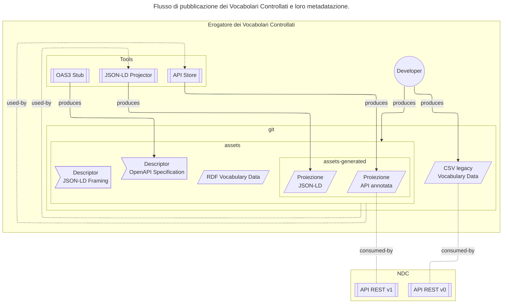
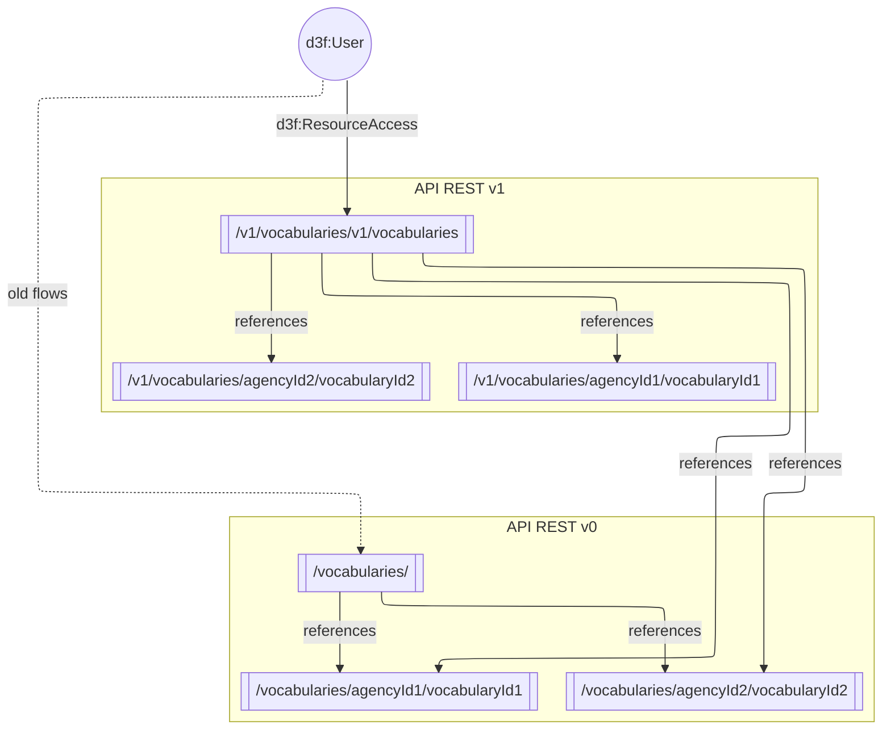
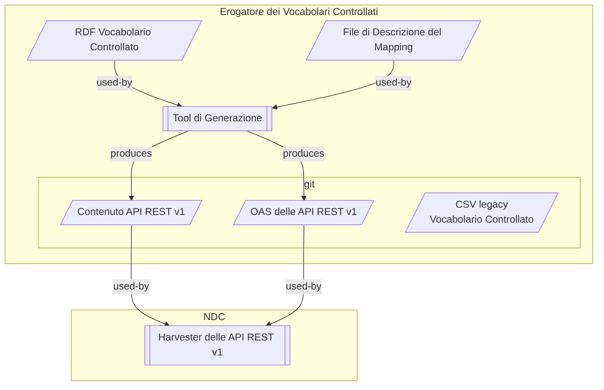

# Schema - Vocabolari Controllati

[Glossario](glossario.md)

## Introduzione (#introduzione)

Il progetto schema.gov.it (National Data Catalog for
Semantic Interoperability) è, insieme alla PDND (Piattaforma
Digitale Nazionale dei Dati), uno dei due cardini della
strategia per l'interoperabilità dell'Italia.

L'obiettivo di schema.gov.it è quello di semplificare la
creazione di servizi pubblici digitali ed API
interoperabili.
Questo avviene tramite la catalogazione e la
pubblicazione di ontologie, schemi dati e vocabolari
controllati (codelist, tassonomie) selezionati, insieme a
funzionalità di visualizzazione e ricerca.

In particolare,
i Vocabolari Controllati sono asset semantici contenenti
codelist e tassonomie utilizzate dai servizi pubblici
digitali.

NDC semplifica il riuso del patrimonio informativo nazionale
pubblicando i Vocabolari Controllati sia in formato RDF che
tramite API REST conformi al Modello di Interoperabilità.

Per rendere più accessibile l'uso delle risorse semantiche,
schema.gov.it mette a disposizione una nuova versione
delle API REST dei Vocabolari Controllati,
basata sui meccanismi di proiezione
descritti in [README.csv.md](README.csv.md).

## Obiettivo (#obiettivo)

Questo documento definisce le specifiche
per pubblicare i contenuti dei Vocabolari Controllati
tramite API REST conformi al Modello di Interoperabilità - in
quanto sistema più accessibile rispetto allo SparQL endpoint.

Inoltre definisce le modalità di integrazione
degli strumenti di supporto all'implementazione delle specifiche
(e.g., strumenti per la generazione delle proiezioni JSON a partire dai dati RDF)
all'interno dello Schema Editor
<https://github.com/teamdigitale/dati-semantic-schema-editor>.

## Descrizione generale (#descrizione-generale)

La versione delle API REST attualmente in produzione
<https://schema.gov.it/api/vocabularies>
(v0.0.1) pubblica la proiezione dei dati RDF che gli enti
hanno estratto in formato CSV.
Questa scelta aveva l'obiettivo di
semplificare la fruizione dei dati fornendo
un meccanismo simile a quello che gli enti già usavano.

La v0.0.1 è precedente al lavoro fatto sull'annotazione
degli schemi dati e sulla produzione delle API semantiche
fatto su:

- [Schema Editor](https://github.com/teamdigitale/dati-semantic-schema-editor);
- [REST API Linked Data Keyword](https://datatracker.ietf.org/doc/draft-polli-restapi-ld-keywords/);

Inoltre, l'estensione della platea degli Erogatori e
l'arbitrarietà nella produzione dei CSV hanno reso diverse
API pubblicate non consistenti con il modello di
interoperabilità.

E' necessario quindi allineare il lavoro di pubblicazione
dei vocabolari a quello delle API semantiche disaccoppiando
la produzione delle API REST dalla produzione dei CSV.

Inoltre, se per gli enti sussiste la necessità di creare dei
CSV utilizzando campi e valori arbitrari, va individuato un
meccanismo ulteriore per proiettare il grafo RDF di un
vocabolario su un dataset lineare (e.g., codelist), più
usabile nel contesto semplice della produzione di servizi
pubblici digitali.

Le specifiche di metadatazione e di proiezione dei dati RDF
in formato JSON che supporteranno le nuove API REST dei
vocabolari controllati sono definite nel documento
[README.csv.md](README.csv.md).



### Relazione tra proiezione JSON e API REST

1. Le API REST pubblicano i dati dei vocabolari
   in formato JSON, insieme ad una specifica OAS3
   che include le annotazioni semantiche utili a ricostruire
   il grafo RDF originale.

1. I dati pubblicati sono basate sulle proiezioni JSON-LD
   descritte in [README.csv.md](README.csv.md)
   e generate tramite la CLI. Per tutti quei campi
   dove non è possibile effettuare una mappatura semantica
   (e.g., campi che non sono mappati a proprietà RDF)
   è possibile associare nel `@context` il valore `null`.

1. Le specifiche di metadatazione semantica si basano
   su [RDF Mapping of OpenAPI Specification](https://datatracker.ietf.org/doc/draft-polli-restapi-ld-keywords/).

1. Gli Erogatori pubblicano sul loro repository git
   in ogni cartella associata ad un vocabolario controllato,
   un file `{asset}.db` che contiene sia i dati che i metadati
   di pubblicazione del vocabolario controllato.
   La CLI permette di generare questo file, anche tramite il supporto
   di un Github Workflow.

1. Per ogni vocabolario controllato presente su schema.gov.it,
   un workflow automatizzato (e.g., GitHub Action) si occupa di
   verificare la presenza del file `{asset}.db` e, in caso positivo,
   lo elabora e lo aggiunge ai dataset dei vocabolari da pubblicare.

1. L'API v1 pubblica sia un catalogo di tutti i vocabolari,
   che i dati dei singoli vocabolari.

## API Vocabolari

### API Esistenti

Le API REST attualmente in produzione (v0.0.1) sono
descritte nell'OAS disponibile all'URL
<https://schema.gov.it/api/openapi.yaml>

Queste erogano as-is il contenuto dei CSV pubblicati dagli
enti: se da un lato permettono quindi una rapida
pubblicazione dei dati, dall'altro non garantiscono la
coerenza con il Modello di Interoperabilità e non sfruttano
le annotazioni semantiche presenti nei vocabolari.

L'eterogeneità dei CSV pubblicati dagli enti, inoltre, rende
difficile l'uso delle API da parte degli utenti finali
poiché i nomi dei campi e i valori usati non sono uniformi
tra i vari vocabolari.

#### Breve descrizione (#api-esistenti-descrizione)

Le API REST attualmente in produzione (v0.0.1) seguono l'OAS
3.0 indicato sopra.

La loro alberatura è la seguente:

- /vocabularies: ritorna l'elenco dei vocabolari
  controllati disponibili. I nomi dei campi e i valori
  ritornati sono uniformi tra i vari vocabolari ma i
  valori nel campo "links" non rispettano le specifiche di
  Link Relation, né contengono le annotazioni semantiche.

  Esempio di risposta:

```yaml
# GET /vocabularies

totalCount: 157
limit: 10
offset: 0
data:
  - title: "Classificazione delle tipologie di strutture ricettive"
    description: "Classificazione dei tipi di strutture ricettive ai sensi del codice del turismo (Decreto legislativo n°79 del 23 maggio 2011). La classificazione è allineata alla classificazione dei LodgingBusiness del vocabolario schema.org"
    agencyId: "agid"
    keyConcept: "accommodation-typology"
    links:
      - href: "https://www.schema.gov.it/api/vocabularies/agid/accommodation-typology"
        rel: "items"
        type: "GET"
  - title: "Tassonomia dei luoghi pubblici di interesse culturale"
    description: "Tassonomia dei luoghi pubblici di interesse culturale. La tassonomia è nata per supportare il lavoro di re-design dei siti web dei comuni. Ove possibile, la tassonomia è allineata a schema.org."
    agencyId: "m_bac"
    keyConcept: "cultural-interest-places"
    links:
      - href: "https://www.schema.gov.it/api/vocabularies/m_bac/cultural-interest-places"
        rel: "items"
        type: "GET"
```

Questo payload non è conforme alle specifiche di Link
Relation definite da IANA
(<https://www.iana.org/assignments/link-relations/link-relations.xhtml>):

- il campo `rel` non contiene una Link Relation valida,
  poiché `items` non è registrata;

- il campo `type` deve contenere un media type e non un
  metodo.

- /vocabularies/{agencyId}: 404 non è esposto, un
  vocabolario va sempre identificato tramite agencyId e
  vocabularyId

- /vocabularies/{agencyId}/{vocabularyId}: ritorna
  l'elenco paginato dei termini del vocabolario
  controllato specificato, che attualmente è una
  proiezione lineare dei dati RDF presenti nel CSV
  pubblicato dall'ente. I nomi dei campi e i valori
  ritornati dipendono dal CSV pubblicato dall'ente, senza
  nessuna garanzia di uniformità tra i vari vocabolari né
  di coerenza con il Modello di Interoperabilità.

  La lingua utilizza i codici del vocabolario
  <http://publications.europa.eu/resource/dataset/language>,
  ad esempio "ITA" per l'italiano anziché i language tag
  (e.g., `it`, `en`, ..) definiti all'interno dell'RDF e
  raccomandati dalle Linee Guida Agid: questa scelta crea
  un problema di interoperabilità poiché la localizzazione
  delle stringhe in RDF è basata sui language tag.

Esempio di risposta:

```yaml
# GET /vocabularies/m_bac/cultural-interest-places

totalResults: 81
limit: 10
offset: 0
data:
  - Label_ITA_2_livello: "Castello"
    Definizione: ""
    Label_ITA_2_livello_alternativa_plurale: "Castelli"
    Label_ITA_2_livello_alternativa_2: ""
    Label_ITA_1_livello_alternativa_siti_web_1: "Rocca e castello"
    Label_ITA_1_livello_alternativa_siti_web_plurale: "Rocche e castelli"
    Codice_2_Livello: "A.1"
    id: "A.1"
    Codice_1_livello: "A"
    Label_ITA_1_livello: "Architettura militare e fortificata"
    Label_ITA_1_livello_alternativa_altri_sistemi: ""
  - Label_ITA_2_livello: "Fortezza"
    Definizione: ""
    Label_ITA_2_livello_alternativa_plurale: "Fortezze"
    Label_ITA_2_livello_alternativa_2: "Cassero"
    Label_ITA_1_livello_alternativa_siti_web_1: "Rocca e castello"
    Label_ITA_1_livello_alternativa_siti_web_plurale: "Rocche e castelli"
    Codice_2_Livello: "A.2"
    id: "A.2"
    Codice_1_livello: "A"
    Label_ITA_1_livello: "Architettura militare e fortificata"
    Label_ITA_1_livello_alternativa_altri_sistemi: ""
```

- <https://www.schema.gov.it/api/vocabularies/m_bac/cultural-interest-places/A.1>

Esempio di risposta:

```yaml
# GET /vocabularies/m_bac/cultural-interest-places/A.1

Label_ITA_2_livello: "Castello"
Definizione: ""
Label_ITA_2_livello_alternativa_plurale: "Castelli"
Label_ITA_2_livello_alternativa_2: ""
Label_ITA_1_livello_alternativa_siti_web_1: "Rocca e castello"
Label_ITA_1_livello_alternativa_siti_web_plurale: "Rocche e castelli"
Codice_2_Livello: "A.1"
id: "A.1"
Codice_1_livello: "A"
Label_ITA_1_livello: "Architettura militare e fortificata"
Label_ITA_1_livello_alternativa_altri_sistemi: ""
```

#### Limitazioni dell'API esistente (#api-esistenti-limitazioni)

L'OAS delle API esposte è all'URL
<https://schema.gov.it/api/openapi.yaml>

Ogni singolo vocabolario dovrebbe avere un meccanismo di
metadatazione proprio, definito dall'Erogatore.

Lo schema dati può anche essere unico, con una mappatura tra
i campi personalizzata.

```yaml
openapi: 3.0.1
...
paths:
  /vocabularies/{agencyId}/{vocabularyId}:
    get:
      summary: "Get vocabulary terms"
      parameters:
        - name: agencyId
          in: path
          required: true
          schema:
            type: string
        - name: vocabularyId
          in: path
          required: true
          schema:
            type: string
      responses:
        '200':
          description: "Vocabulary terms retrieved successfully"
          content:
            application/json:
              schema:
                $ref: '#/components/schemas/VocabularyTerms'
```

### API v1

La nuova API si compone di diversi endpoint, divisi
tra catalogo e dati:

- catalogo: pubblica l'elenco dei vocabolari controllati
  disponibili, con i metadati e i link alle
  distribuzioni API REST v1;

- dati: pubblica i dataset dei vocabolari controllati,
  con i metadati e le annotazioni semantiche che collegano
  i campi JSON alle proprietà RDF del vocabolario.

#### Generazione indipendente dai CSV

Nella v1 delle API, i dati sono indipendenti dai CSV
esistenti, e vengono generati a partire dal grafo RDF
tramite una coppia di descrittori:

- un frame JSON-LD che descrive la proiezione dei dati RDF in
  formato JSON, e contiene le annotazioni semantiche che
  collegano i campi JSON alle proprietà RDF del vocabolario
  controllato;
- un OAS3.0 con i metadati e lo schema dei dati esposti.

Questo disaccoppia la distribuzione dei dati presenti nelle API
da quella dei CSV e permette la pubblicazione di nuovi dati
senza impattare sugli utenti che
utilizzano i dati attualmente presenti nei CSV.

Quando un erogatore vuole pubblicare l'API REST di un
vocabolario controllato, dovrà produrre:

- un frame JSON-LD, da cui generare la proiezione JSON;
- un OAS3.0 che contiene i metadati e lo schema dei dati esposti.

#### Pubblicazione (#api-v1-pubblicazione)

1. Analogamente al modello di erogazione attuale, le API
   vengono rese disponibili da un Server URL centralizzato
   e.g. <https://schema.gov.it/api/vocabularies/v1/> che funge
   da catalogo e restituisce un linkset RFC 9727 con le
   distribuzioni API dei vocabolari controllati.

1. L'OAS v1 di riferimento è mantenuto in
   [apiv1/openapi/vocabularies.yaml](apiv1/openapi/vocabularies.yaml) ed è basato sulla semantica dei
   vocabolari RDF, disaccoppiando il contenuto esposto
   dalle eventuali proiezioni CSV legacy, che ritorna
   l'elenco di tutti gli endpoint. L'OAS è in linea, ma non
   identico, a quello attuale.

1. Gli endpoint di healt-check e di servizio sono:

   - `/openapi.yaml`: restituisce l'OAS3.0 dell'API REST v1, che contiene i
     metadati e lo schema dei dati esposti. Lo schema dei dati
     di dettaglio del vocabolario `#/components/schemas/Item`
     è definito in modo generico; quello di dettaglio
     è definito nell'OAS del singolo vocabolario,
     che include anche le annotazioni semantiche che collegano i campi JSON
     alle proprietà RDF del vocabolario controllato, e viene pubblicato al path
     (i.e. `/vocabularies/{agencyId}/{vocabularyId}/openapi.yaml`).
   - `/status`: verifica lo stato di salute dell'API.

<!-- Catalogo -->

1. Gli endpoint di catalogo sono:

   - `/vocabularies`: restituisce il linkset RFC 9727 con
     i metadati. Supporta paginazione (`limit`, `offset`) e
     filtri testuali o per metadata.
   - `/vocabularies/{agencyId}`: restituisce i
     vocabolari pubblicati da uno specifico ente.

1. Lo schema dati presenta una serie di annotazioni
   semantiche che collegano i campi JSON alle proprietà RDF
   del vocabolario controllato;
   ad esempitraccia
   la precedente versione dell'API facilitando la migrazione tra v0 e v1.

1. Il campo `predecessor-version`, associato alla
   RDF property <http://purl.org/linked-data/xkos#supersedes>  referenzia la versione
   precedente dell'API, facilitando la migrazione degli
   utenti.

```yaml
# Il risultato è di tipo application/linkset+json:
#   NB: la specifica RFC9727 definisce il formato linkset
#       come un oggetto JSON con la sola proprietà "linkset".
linkset:
-
  # RFC9727 api-catalog indica l'URL del catalogo API
  api-catalog: https://schema.gov.it/api/vocabularies/v1/
  anchor: https://schema.gov.it/api/vocabularies/v1/
  # ... pagination properties  either limit/offset/cursor (non
  #     standard but backward compatible), or prev/next link rel ...
  item:  # RFC6573 indica una serie di elementi contenuti nell'anchor.
  - # Campi definiti in RFC8288 Web Linking
    href: http://api.example.com/foo/v1  # RFC8288
    title: My Foo API
    hreflang: [it, en, de]
    service-desc:  # RFC8631
    - href: http://api.example.com/foo/v1/vocabularies/istat/cities/openapi.yaml
      type: application/openapi+yaml
    predecessor-version: # RFC5829
    - href: https://schema.gov.it/api/vocabularies/istat/cities # RFC8288
    # Campi custom.
    description: "Extracted from vocabulary XYZ"
```

1. Un esempio di deploy conforme alle Linee Guida per le API REST del
   Modello di Interoperabilità, l'URL delle API REST
   conterrà la versione dell'API, è il seguente:

   - l'indirizzo con l'elenco dei vocabolari
     <https://schema.gov.it/api/vocabularies/v1/vocabularies>;
   - l'indirizzo di un vocabolario specifico sarà
     `https://schema.gov.it/api/vocabularies/v1/vocabularies/{agencyId}/{keyConcept}`.

1. L'API REST v1 utilizza i meccanismi di paging descritti
   nelle Linee Guida per le API REST del Modello di
   Interoperabilità.

<!-- Dati -->

1. L'API pubblica anche i dati dei vocabolari controllati,
   con la specifica di dettaglio del singolo vocabolario
   pubblicata al path
   `/vocabularies/{agencyId}/{vocabularyId}/openapi.yaml`;
   questo supporta sia `application/openapi+yaml` che `text/plain` per
   human-readability.

1. L'OAS contiene i dati delle annotazioni semantiche che permettono
   di ricostruire il grafo RDF originale a partire dal JSON.
   Inoltre contengono il campo `href` che punta alla risorsa stessa:
   questo campo viene disassociato nel `@context`.

1. L'API REST v1 permette l'accesso puntuale alle risorse
   del vocabolario.
   L'accesso puntuale supporta un sottoinsieme limitato di caratteri
   che include `/`.

1. I dati dei vocabolari controllati vengono erogati
   usando i meccanismi di paginazione descritti nelle Linee Guida
   per le API REST del Modello di Interoperabilità (i.e. limit, cursor).

1. I dati dei vocabolari possono contenere riferimenti a risorse
   collegate, sia via URI presenti nel grafo RDF, sia tramite campi specifici definiti dall'erogatore.

1. Per semplificare l'integrazione con sistemi di visualizzazione
   (e.g., Schema Editor, Swagger UI, ) l'API supporta il meccanismo
   dei [CORS](https://developer.mozilla.org/en-US/docs/Web/HTTP/CORS).



Elementi di migrazione:

1. La precedente versione delle API REST (v0.0.1)
   può essere erogata per il tempo
   concordato con gli Erogatori all'URL
   <https://schema.gov.it/api/vocabularies/v0/>
   permettendo la migrazione degli utenti verso la nuova
   versione.

1. L'URL attuale <https://schema.gov.it/api/vocabularies/>
   può essere in seguito rediretto sulla versione delle API v0 fino a
   quando la v0 verrà dismessa.

#### Requisiti opzionali

1. Localizzazione: l'Erogatore decide la lingua principale di pubblicazione
   dei dati dei vocabolari usando la property `@language` del frame.
   Poiché i vocabolari non hanno sempre una localizzazione completa,
   la localizzazione tramite meccanismo di content negotiation
   (e.g., `Accept-Language`) non verrà implementata in questa release.

#### Metadatazione semantica

1. Le API REST v1 pubblicano la specifica OAS
   di ogni singolo vocabolario.

1. Nella v1, la struttura dell'OAS sarà simile a quella
   attuale per facilitare la migrazione degli utenti, e
   seguirà una struttura lineare. Una ulteriore evoluzione
   delle API REST potrà prevedere una struttura più
   aderente al grafo RDF del vocabolario controllato.

1. L'OAS contiene le annotazioni semantiche che collegano i
   campi delle proiezioni JSON alle proprietà RDF del
   vocabolario controllato. Il contenuto delle annotazioni
   semantiche viene definito dall'Erogatore ed è contenuto
   nel template OAS3 generato tramite il supporto della CLI (e.g., `{asset}.oas3.yaml`).
   L'OAS finale viene generato automaticamente dall'API
   a partire da esso.

1. I vocabolario possono utilizzare riferimenti semantici
   contenuti o meno in schema.gov.it. Ad esempio, alcuni
   vocabolari utilizzano SKOS o DCAT.

   ```turtle
    @prefix skos: <http://www.w3.org/2004/02/skos/core#> .
    @prefix dcat: <http://www.w3.org/ns/dcat#> .
    @base   <https://w3id.org/italia> .

    <italia/social-security/controlled-vocabulary/CUStatement/codice_titolo_erogazione_tfr/A>
        rdf:type            skos:Concept;

        # DCAT modeling.
        rdfs:label          "se si tratta di anticipazione;"@it;
        dcterms:identifier  "A";

        # Skos modeling.
        skos:inScheme       <italia/social-security/controlled-vocabulary/CUStatement/codice_titolo_erogazione_tfr>;
        skos:notation       "A";
        skos:prefLabel      "se si tratta di anticipazione;"@it .
   ```

1. Le guide [manual-csv.md](manual-csv.md) e [manual-api.md](manual-api.md)
   mostrano come mappare i campi RDF e JSON, per
   permettere agli Erogatori di scegliere la
   rappresentazione più adatta ai loro vocabolari
   controllati. Questo semplificherà anche l'erogazione di
   API basate su vocabolari stratificati.

#### Generazione delle proiezioni JSON e integrazione delle annotazioni semantiche nelle API

1. Il documento [README.csv.md](README.csv.md) descrive il
   processo di proiezione dei dati RDF in formato JSON per
   le API REST v1 in modo da verificare che il processo di
   proiezione sia invertibile, ossia che sia possibile
   ricostruire il grafo RDF originale a partire dal JSON e
   dall'annotazione semantica.

1. La CLI facilita la generazione
   delle proiezioni JSON a partire dai dati RDF e
   l'integrazione delle annotazioni semantiche nelle API
   REST v1. La CLI è open source, in conformità al
   Codice per l'Amministrazione Digitale.



#### Limitazioni

1. Le API REST v1 continueranno a erogare solo proiezioni
   lineari dei vocabolari controllati (e.g., codelist). Non
   verranno erogate strutture ad albero o grafi. Queste
   potranno essere oggetto di future evoluzioni delle API
   REST.

1. La piattaforma non valida nel merito il file di
   descrizione del mapping fornito dagli Erogatori. La
   responsabilità della correttezza del file di descrizione
   del mapping rimane all'Erogatore. Potrà essere validato
   il formato del file di mappatura (frame) e verificata la
   presenza dei campi obbligatori che ogni API REST v1 deve
   esporre.

1. Il calcolo del Semantic Score delle API dei vocabolari
   potrebbe non tenere conto dei riferimenti semantici
   generici e/o non presenti in schema.gov.it (e.g.,
   riferimenti a vocabolari esterni come schema.org, oppure
   SKOS).

1. I campi ritornati potranno essere limitati ai seguenti
   tipi: `string`, `array`, `object`. Questo perché i valori dei
   vocabolari controllati sono definiti tramite specifiche
   XSD che non sono sempre mappabili in tipi JSON più
   complessi (e.g., date, numeri, booleani). La
   deserializzazione dei campi è lasciata ai Fruitori.

1. Gli strumenti forniti a supporto della generazione delle
   proiezioni JSON saranno basati su librerie open source
   che implementano le specifiche JSON-LD e RDF: eventuali
   limitazioni e/o bug di tali librerie si rifletteranno
   sugli strumenti stessi.

1. Quando viene pubblicata una nuova versione di un
   vocabolario controllato, l'API REST v1 erogherà la
   versione nuova del vocabolario controllato, e la vecchia
   versione non sarà più disponibile. La versione dell'API
   dei vocabolari controllati è indipendente dalla versione
   del vocabolario controllato erogato.

   Esempio:

   Il vocabolario controllato "ateco-2007" viene pubblicato
   a partire dai dati nella directory
   `/asset/controlled-vocabularies/ISTAT/ateco-2007/latest/`.
   Se ISTAT
   pubblica una nuova versione del vocabolario controllato
   "ateco-2007" (ad esempio,
   `/asset/controlled-vocabularies/ISTAT/ateco-2007/2025-01-01/`), con
   `/asset/controlled-vocabularies/ISTAT/ateco-2007/latest/`
   che punta alla nuova versione, l'API REST v1
   erogherà la nuova versione del vocabolario controllato
   che sarà "ateco 2007 - revisione 2021".

## PoC

La PoC si compone:

- di un applicativo containerizzato che implementa gli endpoint
  della Data e della Catalog API;
- della CLI che genera lo stub OAS3 e che genera il file `{asset}.db`;
- di un harvester che recupera  recupera i database generati dagli Erogatori,
  li aggrega in un unico `vocabularies.db` file che viene pubblicato su github;

Il codice della PoC è implementato in Python 3.12+
ed utilizza il framework Connexion per l'implementazione delle API REST.

### CLI {#cli-api}

Il progetto fornisce una CLI che permette di:

- generare lo stub OAS3 a partire dai dati e dai metadati
  dei vocabolari controllati;
- popolare il database SQLite a partire dai dati e dai
  metadati dei vocabolari controllati.

### Struttura del database SQLite {#struttura-del-database}

Il database APIStore ha una struttura
standardizzata:

- `_metadata`: tabella di catalogo con
  una riga per vocabolario. Le colonne
  contengono sia una chiave basata su `agency_id` e `key_concept`
  come già presente nella v0, sia tutta una serie
  di metadati presi dal TTL, nonché l'OAS generato a partire dal file di descrizione del mapping.
  La tabella supporta un indice full-text configurabile
  in fase di harvesting.
- Tabelle dei vocabolari: una tabella
  per ogni vocabolario, con nome univocamente generato,
  che contiene i record ed il payload completo
  di ogni voce del vocabolario.

### Vocabulary API (#poc-vocabulary-api)

L'applicativo che implementa la Catalog API è nella cartella
[apiv1/](apiv1/).

La documentazione dell'API è definita nell'OAS che viene assemblato
automaticamente a partire dai file YAML presenti nella cartella.

[apiv1/openapi/vocabularies.yaml](apiv1/openapi/vocabularies.yaml).

Viene testato ed assemblato come container Docker tramite GitHub Actions
e pubblicato sul Github Container Registry di questo repository.

Il container viene avviato tramite `uvicorn` come server ASGI di produzione:

```bash
docker run ghcr.io/<org>/dati-semantic-csv-apis-data \
  --workers 2 --log-level info
```

Tutte le opzioni di `uvicorn` possono essere passate come argomenti al container
oppure tramite le variabili d'ambiente `UVICORN_*` (es. `UVICORN_WORKERS=2`);
in particolare si segnalano:

| Variabile                     | Default     | Descrizione                                                                                                                                                     |
| ----------------------------- | ----------- | --------------------------------------------------------------------------------------------------------------------------------------------------------------- |
| `UVICORN_WORKERS`             | `1`         | Numero di worker da avviare                                                                                                                                     |
| `UVICORN_LOG_LEVEL`           | `warning`   | Livello di logging da utilizzare                                                                                                                                |
| `UVICORN_FORWARDED_ALLOW_IPS` | `0.0.0.0/0` | Indirizzi IP consentiti per l'intestazione `X-Forwarded-For`: necessario per il corretto funzionamento dietro un proxy (e.g. un terminatore TLS, Openshift, ..) |

Le variabili d'ambiente applicative sono:

| Variabile               | Default                 | Descrizione                                      |
| ----------------------- | ----------------------- | ------------------------------------------------ |
| `API_BASE_URL`          | `http://localhost:8080` | URL base dell'API                                |
| `CACHE_CONTROL_MAX_AGE` | `3600`                  | Valore `max-age` per `Cache-Control`             |
| `CORS_ORIGINS`          | `*`                     | Valori per `Access-Control-Allow-Origin` (CORS)  |
| `HARVEST_DB`            | `harvest.db`            | Percorso o URL del datastore SQLite              |
| `SWAGGER_UI`            | `false`                 | Se `true`, abilita Swagger UI all'endpoint `/ui` |

### Harvesting PoC (#poc-harvesting)

Per popolare il datastore con i dati dei vocabolari
controllati pubblicati tramite la Data API,
è stato implementato un harvester che
itera i repository dei vocabolari controllati
presenti su schema.gov.it,
estrae i link ai file turtle e verifica la
presenza di un file chiamato `{asset_name}.db`.

In tal caso, scarica il file `{asset_name}.db`
e lo utilizza per popolare il datastore.
Questo meccanismo permette agli Erogatori di
pubblicare volontariamente le proprie API
decidendo i dettagli specifici di pubblicazione,
che devono comunque essere conformi alle
specifiche definite in questo documento.

L'harvester è implementato tramite github workflow su un repository dedicato:
<https://github.com/teamdigitale/dati-semantic-harvest>.

Questo workflow:

1. viene eseguito periodicamente (ad esempio, ogni 24h);
1. referenzia una versione rilasciata della CLI,
   per garantire stabilità ed evitare breaking
   changes durante lo sviluppo;
1. recupera da <https://schema.gov.it/sparql> l'elenco dei vocabolari controllati
   con un `NDC:keyConcept`;
1. per ogni vocabolario:
   1. verifica la presenza di una `dcat:distribution` in formato `text/turtle`,
      e in tal caso scarica dall'URL associato il file `{asset_name}.db`;
   1. aggiunge il contenuto del file `{asset_name}.db` al dataset dei vocabolari da pubblicare.
1. pubblica il file `vocabularies.db` sul repository.
