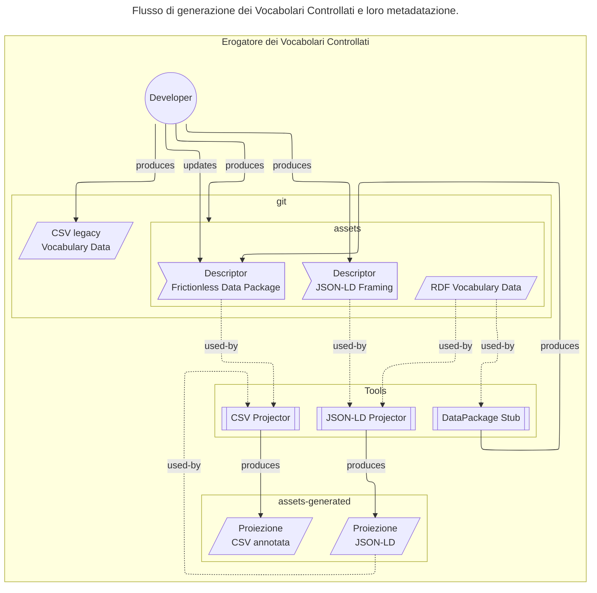
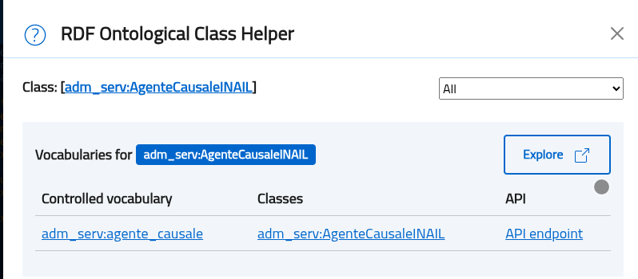
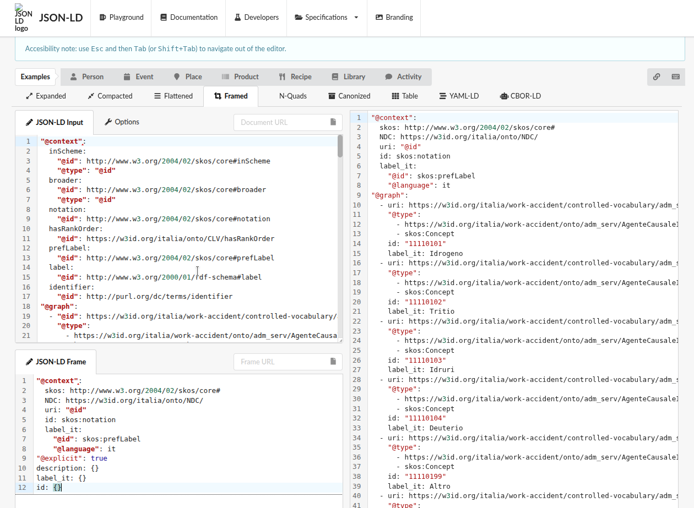

# Generazione e metadatazione dei CSV (#generazione-e-metadatazione-dei-csv)

[Glossario](glossario.md)

## Introduzione (#introduzione)

Il progetto schema.gov.it (National Data Catalog for
Semantic Interoperability) è, insieme alla PDND (Piattaforma
Digitale Nazionale dei Dati), uno dei due cardini della
strategia per l'interoperabilità dell'Italia.

L'obiettivo di schema.gov.it è quello di semplificare la
creazione di servizi pubblici digitali ed API
interoperabili. Questo avviene tramite la catalogazione e la
pubblicazione di ontologie, schemi dati e vocabolari
controllati (codelist, tassonomie) selezionati, insieme a
funzionalità di visualizzazione e ricerca.

In particolare,
i Vocabolari Controllati sono asset semantici contenenti
codelist e tassonomie utilizzate dai servizi pubblici
digitali.

Per rendere più accessibile l'uso delle risorse semantiche,
schema.gov.it fornisce una specifica per la generazione di
dataset in formati più semplici da usare, come CSV e
YAML-LD, a partire dai dataset RDF a grafo.
Inoltre, mette a disposizione uno strumento in PoC
per la generare automaticamente tali dataset.

## Obiettivo (#obiettivo)

Questo documento definisce i requisiti di un sistema di
generazione e di metadatazione dei CSV su cui basare dei
processi automatizzati per trasformare vocabolari
controllati in formato RDF (text/turtle) in rappresentazioni
lineari (CSV) e strutturate (YAML-LD/JSON) più accessibili e
utilizzabili.

## Descrizione generale (#descrizione-generale)

Il meccanismo di metadatazione ha questi obiettivi:

1. Semplificare la fruizione dei vocabolari controllati per
   sviluppatori e PA che necessitano di formati tabulari
   standard
1. Preservare la semantica dei dati mantenendo i
   riferimenti alle ontologie originali tramite annotazioni
   JSON-LD
1. Preservare le informazioni di versioning esistenti nei
   vocabolari attuali
1. Disaccoppiare la distribuzione dei dati dalla loro
   rappresentazione originale RDF, permettendo proiezioni
   personalizzate senza modificare i grafi sorgente
1. Abilitare l'integrazione futura con API REST v1
   attraverso la generazione di proiezioni JSON annotate
   semanticamente

Durante la generazione dei Frictionless Data Package,
vengono applicate euristiche per la selezione delle lingue:
si considerano solo i tag `it` ed `en` definiti in `dcterms:language`
dando priorità ai metadati in italiano.

Ad oggi gli Erogatori pubblicano vocabolari controllati in
formato RDF (Turtle) JSON e CSV. Spesso questi CSV sono
generati manualmente, tramite query SPARQL o script ad-hoc.
Talvolta vengono pre-elaborati tramite strumenti interattivi
(e.g., Microsoft Excel) portandosi dietro incongruenze o
specifiche idiosincrasie. A regime quindi, si vuole evitare
che schema.gov.it (e.g., l'harvester) debba dipendere da
questi CSV.

La dipendenza dei Fruitori da CSV "legacy" ha complicato
l'evoluzione in chiave semantica dei vocabolari controllati;
Si è deciso quindi di adottare un approccio più strutturato
dove i dati RDF vengono proiettati in un formato strutturato
(YAML-LD/JSON); e in un secondo momento, da questa
rappresentazione strutturata, gli Erogatori che lo
desiderano possono generare CSV standardizzati seguendo il
processo descritto in questo documento.



### Relazione tra proiezioni JSON e CSV (#relazione-tra-proiezioni-json-e-csv)

1. Gli Erogatori che lo desiderano, possono continuare a
   pubblicare i CSV legacy in modo da mantenere la
   retrocompatibilità con i Fruitori esistenti. In questo
   caso la possibilità di metadatare le informazioni è
   limitata: se i campi del CSV sono il frutto di una
   manipolazione specifica del grafo originale (e.g.,
   unendo i valori di più proprietà, ..) non è detto sia
   possibile ricostruire le relazioni semantiche
   originarie, né associare ad una colonna del CSV una
   proprietà RDF univoca.

1. Gli Erogatori possono passare al nuovo modello di
   generazione automatica delle proiezioni JSON-LD e CSV
   seguendo le regole descritte in questo documento.

1. Le proiezioni JSON-LD generate contengono un
   sottoinsieme delle informazioni semantiche presenti nel
   grafo RDF originale, incluse le proprietà SKOS e i
   riferimenti alle ontologie.

### Modalità di funzionamento (#modalita-di-funzionamento)

1. Generare metadati strutturati conformi agli standard
   Frictionless Data per facilitare la validazione e l'uso
   dei dataset

Questo approccio garantisce l'interoperabilità tra il mondo
semantico (RDF/SKOS) e quello applicativo (CSV/JSON),
mantenendo la tracciabilità e la coerenza dei dati.

## Requisiti utente (#requisiti-utente)

### Limitazioni (#limitazioni)

1. I vocabolari controllati devono essere espressi in RDF
   utilizzando la terminologia SKOS; ulteriori modelli
   potranno essere supportati in seguito.

1. Le proprietà SKOS minime richieste sono:

- `rdf:type` a `skos:Concept`: per identificare i concetti
  all'interno del vocabolario;
- `skos:prefLabel`: per la label principale del concetto;
- `skos:notation`: per l'identificatore univoco del concetto
  all'interno del vocabolario;
- `skos:inScheme`: per individuare il vocabolario di
  appartenenza. Ulteriori proprietà SKOS possono essere
  utilizzate, a patto che siano presenti con valori
  consistenti su tutti i record.

1. Gli Erogatori sono responsabili, per ogni vocabolario
   controllato, della redazione dei contenuti prodotti,
   inclusi i file di framing JSON-LD e della correttezza
   sintattica e semantica dei CSV generati.

1. La generazione dei CSV e YAML-LD si basa su regole di
   mapping predefinite nei file di framing; modifiche a
   tali regole richiedono l'aggiornamento dei file di
   framing.

1. La creazione delle proiezioni è effettuata dagli
   Erogatori, che devono verificare la correttezza dei dati
   generati prima della pubblicazione.

1. Il codice della PoC non ha requisiti specifici in
   termini di performance; questo non è un problema
   stringente poiché la dimensione dei vocabolari
   controllati è generalmente limitata (tipicamente poche
   migliaia di voci) e il processo di generazione avviene
   offline (e.g., in fase di build del dataset).

1. I campi ritornati potranno essere limitati ai seguenti
   tipi JSON: `string`, `array`, `object`. Questo perché i valori dei
   vocabolari controllati sono definiti tramite specifiche
   XSD che non sono sempre mappabili in tipi JSON più
   complessi (e.g., date, numeri, booleani). La
   deserializzazione dei campi è lasciata ai fruitori.

1. Gli strumenti forniti a supporto della generazione delle
   proiezioni JSON saranno basati su librerie open source
   che implementano le specifiche JSON-LD e RDF: eventuali
   limitazioni e/o bug di tali librerie si rifletteranno
   sugli strumenti stessi.

1. I tool possono processare le entry in batch per ridurre
   l'uso di memoria RAM e migliorare le performance
   complessive. Tuttavia, quando si utilizzano funzionalità
   di embedding (e.g., `@embed: @always`), è possibile che
   le entry nidificate non vengano completamente catturate
   se si estendono oltre i confini del batch. Per questo,
   il default è processare l'intero dataset in un unico
   batch.

1. Completezza delle proiezioni: dipendentemente dai
   criteri di filtering definiti nel file di framing, le
   proiezioni JSON-LD e CSV generate potrebbero non
   includere tutte le risorse presenti nel vocabolario RDF
   originale.

   Esempi:

   - risorse con proprietà obbligatorie mancanti (e.g.,
     `skos:notation`);
   - risorse `@type` diverso da quello definito nel
     framing (e.g., non `skos:Concept`);
   - risorse non esplicitamente appartenenti al
     vocabolario (e.g., `skos:inScheme` mancante o
     diverso).

   Esempio 1: Risorsa con proprietà obbligatoria mancante
   (`skos:notation`)

   ```turtle
   @prefix skos: <http://www.w3.org/2004/02/skos/core#> .
   @prefix ex: <http://example.org/vocab/> .

   # Risorsa valida - verrà inclusa nella proiezione
   ex:concept001 a skos:Concept ;
       skos:notation "001" ;
       skos:prefLabel "Concetto Valido" ;
       skos:inScheme ex:myVocabulary .

   # Risorsa NON valida - ESCLUSA dalla proiezione
   # Manca skos:notation
   ex:concept002 a skos:Concept ;
       skos:prefLabel "Concetto Senza Notation" ;
       skos:inScheme ex:myVocabulary .
   ```

   Esempio 2: Risorsa con `@type` diverso da quello del
   framing

   ```turtle
   @prefix skos: <http://www.w3.org/2004/02/skos/core#> .
   @prefix ex: <http://example.org/vocab/> .

   # Risorsa valida - verrà inclusa nella proiezione
   ex:concept003 a skos:Concept ;
       skos:notation "003" ;
       skos:prefLabel "Concetto di tipo skos:Concept" ;
       skos:inScheme ex:myVocabulary .

   # Risorsa NON valida - ESCLUSA dalla proiezione
   # Il tipo è skos:Collection invece di skos:Concept
   ex:collection001 a skos:Collection ;
       skos:notation "C001" ;
       skos:prefLabel "Collezione non Concept" ;
       skos:inScheme ex:myVocabulary .
   ```

   Esempio 3: Risorsa senza appartenenza esplicita al
   vocabolario (`skos:inScheme` mancante o diverso)

   ```turtle
   @prefix skos: <http://www.w3.org/2004/02/skos/core#> .
   @prefix ex: <http://example.org/vocab/> .
   @prefix other: <http://example.org/other/> .

   # Risorsa valida - verrà inclusa nella proiezione
   ex:concept004 a skos:Concept ;
       skos:notation "004" ;
       skos:prefLabel "Concetto del vocabolario corretto" ;
       skos:inScheme ex:myVocabulary .

   # Risorsa NON valida - ESCLUSA dalla proiezione
   # Manca completamente skos:inScheme
   ex:concept005 a skos:Concept ;
       skos:notation "005" ;
       skos:prefLabel "Concetto senza skos:inScheme" .

   # Risorsa NON valida - ESCLUSA dalla proiezione
   # Appartiene ad un vocabolario diverso
   ex:concept006 a skos:Concept ;
       skos:notation "006" ;
       skos:prefLabel "Concetto di altro vocabolario" ;
       skos:inScheme other:differentVocabulary .
   ```

### Requisiti di base (#requisiti-di-base)

La specifica:

- descrive come processare un vocabolario controllato RDF
  in formato Turtle (.ttl) modellato secondo l'ontologia
  SKOS per generare un sottoinsieme dei dati in formato
  JSON-LD;
- definisce la mappatura di base tra un sottoinsieme delle
  proprietà SKOS e i campi del JSON-LD risultante;
- definisce la mappatura di base tra un sottoinsieme delle
  proprietà SKOS e le colonne del CSV risultante;
- permette all'Erogatore di definire ulteriori campi
  personalizzati, senza che per tali campi sia necessario
  un mapping diretto in RDF e/o SKOS;
- permette di aggiungere ulteriori informazioni al JSON-LD
  e al CSV, ma tali informazioni non avranno una
  corrispondenza diretta nel grafo RDF originale.
- definisce un file di metadatazione Frictionless Data
  Package (datapackage.yaml/json) utile a processare il
  CSV;
- definisce le regole di serializzazione in CSV (encoding,
  separatori, ecc.) per i file con un datapackage
  associato.

La PoC:

- implementa le funzionalità della specifica in Python;
- è basata su librerie open source
- può essere usata come riferimento per
  la generazione automatica dei CSV e YAML-LD a partire dai
  vocabolari controllati RDF.

### Requisiti opzionali

- Gestione delle gerarchie parent-child estraendo
  l'identificatore dal campo `skos:broader`
- Localizzazione delle label in multiple lingue (it, en,
  de) ove presenti nel grafo RDF
- Generazione di uno stub del datapackage con campi
  indicati dall'Erogatore nel file di framing JSON-LD
- Gestione di chiavi univoche derivate dall'URI del
  concetto (es. estraendo la parte finale dell'URI)

## Progettazione

Il meccanismo di generazione e metadatazione dei CSV è
basato sulle seguenti specifiche:

- RDF: per rappresentare i vocabolari controllati secondo
  l'ontologia SKOS;
- JSON-LD framing: per definire le regole di proiezione
  dal grafo RDF alla rappresentazione JSON-LD;
- Frictionless Data Package: per la metadatazione e la
  proiezione in formato CSV.

Le principali decisioni architetturali vengono tracciate
nella forma di Architecture Decision Records (ADR)
e sono presenti in [docs/adr](../adr/).

Il processo di sviluppo è test driven.
Ogni commit è accompagnato da test automatici che verificano
la correttezza del codice e la conformità alle specifiche.
(Vedi [Test](#test)).

### Processo di validazione

#### Validazione JSON-LD

Un file JSON-LD è conforme a questa specifica se, applicando
il `@context` definito nel file di framing, si ottiene un
sottoinsieme del grafo RDF originale.

#### Validazione CSV

Un CSV è conforme a questa specifica se applicando il
seguente processo si ottiene un sottoinsieme del grafo RDF
originale:

1. deserializzazione del CSV originale usando il CSV
   dialect definito nel datapackage associato; quindi ogni
   riga del CSV viene convertita in un oggetto JSON usando
   i nomi di colonna come chiavi.

   Ad esempio, usando il seguente "dialect" (vedi
   <https://datapackage.org/standard/csv-dialect/>) e
   `x-jsonld-context` (vedi REST API Linked Data Keywords)
   definiti nel datapackage:

   ```yaml
   # Datapackage metadata
   ...
    resources:
      - path: "vocabulary.csv"
        ...
        dialect:
          delimiter: ","
          lineTerminator: "\n"
          quoteChar: "\""
          doubleQuote: true
          skipInitialSpace: true
          header: true
          caseSensitiveHeader: false
          encoding: "utf-8"
        ...
        schema:
          fields:
            - name: "id"
              type: "string"
            - name: "uri"
              type: "string"
            - name: "label"
              type: "string"
          x-jsonld-context:
            id: http://purl.org/dc/terms/identifier
            uri: "@id"
            label: http://www.w3.org/2004/02/skos/core#prefLabel
   ```

   la riga

```text
"id","uri","label"
"001","http://example.org/concept/001","Concetto Uno"
"002","http://example.org/concept/002","Concetto Due"
```

diventa il JSON:

```yaml
- id: "001"
  uri: http://example.org/concept/001
  label: Concetto Uno
- id: "002"
  uri: http://example.org/concept/002
  label: Concetto Due
```

1. creazione di un JSON-LD immergendo il contenuto del
   punto precedente in un oggetto con le seguenti chiavi:

   - `@context`: definito nel file di framing per mappare
     i campi JSON alle proprietà RDF;
   - `@graph`: array di oggetti JSON generati al punto
     precedente;

   Ad esempio, usando il `@context` definito di seguito, si
   ottiene il seguente JSON-LD:

```yaml
"@context":
  id: http://purl.org/dc/terms/identifier
  uri: "@id"
  label: http://www.w3.org/2004/02/skos/core#prefLabel
"@graph":
  - id: "001"
    uri: http://example.org/concept/001
    label: Concetto Uno
  - id: "002"
    uri: http://example.org/concept/002
    label: Concetto Due
```

che dà luogo al grafo RDF:

```turtle
@prefix skos: <http://www.w3.org/2004/02/skos/core#> .
<http://example.org/concept/001> skos:notation "001" ;
                                   "skos:prefLabel" "Concetto Uno" .
<http://example.org/concept/002> "skos:notation" "002" ;
                                   "skos:prefLabel" "Concetto Due" .
```

### Note

- Un CSV può contenere campi aggiuntivi che non hanno una
  corrispondenza diretta nel grafo RDF originale. Questi
  campi saranno comunque presenti nel JSON-LD generato ma
  nel `@context` dovranno essere disassociati.

  Esempio:

  ```text
  "id","uri","label","customField"
  "001","http://example.org/concept/001","Concetto Uno","Valore Personalizzato"
  ```

### Funzioni di base

- Processare un vocabolario controllato RDF in formato
  Turtle (.ttl) modellato secondo l'ontologia SKOS
  per generare un sottoinsieme dei dati in formato JSON-LD
  secondo le regole definite in un file di framing
  JSON-LD.

Vedi [Requisiti di base](#requisiti-di-base)
e [Requisiti opzionali](#requisiti-opzionali).

### Funzionalità della PoC

La PoC implementa le funzionalità descritte nei requisiti di
base in una libreria Python eseguibile sia da riga di
comando che come modulo importabile.

L'eseguibile permette di:

- generare una proiezione JSON-LD a partire da un file RDF
  Turtle e un file di framing JSON-LD.
  La proiezione può essere ulteriormente filtrata
  dei campi non presenti all'interno del `context`
  (si veda sezione [Filtro dei Campi non Mappati](#f-filtro-campi-non-mappati) per maggiori dettagli);

- generare un file CSV annotato (con datapackage) a
  partire dalla proiezione JSON-LD generata nel passo
  precedente;

- processare un file alla volta, per processare in
  parallelo più file è possibile eseguire più istanze
  dell'eseguibile o utilizzare tool di orchestrazione
  esterni che richiamano le funzioni della libreria.

La libreria viene rilasciata con una licenza open source e
può essere estesa o adattata alle esigenze specifiche degli
Erogatori.

Opzionalmente, la PoC supporta alcune funzionalità
aggiuntive come descritto nei requisiti opzionali.

Il codice sorgente:

- è basato su python 3.12+;
- include una serie di test automatici per verificare la
  correttezza del processo di generazione e la conformità
  ai requisiti specificati;
- è documentato con esempi di utilizzo e indicazioni per
  l'estensione e la personalizzazione;
- produce dei log con livello di dettaglio configurabile
  per facilitare il debug e il monitoraggio del processo
  di generazione;
- restituisce 0 come exit code in caso di successo e un
  codice di errore non-zero in caso di fallimento.

### Supporto visuale al framing

Lo Schema Editor fornisce un supporto visuale alla creazione
del frame JSON-LD, mostrando un'anteprima del JSON generato.
Questa UI è basata sul JSON-LD Playground,
un tool open source pubblicato dal W3C per testare e sperimentare con JSON-LD.

Tramite l'RDF Helper dello Schema Editor, è possibile
trovare un link all'interfaccia di verifica del framing.


Si veda la PR: <https://teamdigitale.github.io/dati-semantic-schema-editor/>

Quando si esplora un vocabolario controllato,
la UI mostra un estratto dei dati in JSON-LD
dove è possibile modificare il frame per vedere
come cambia la proiezione JSON-LD in tempo reale,
in modo da iterare rapidamente sulla modifica del frame
fino ad ottenere la proiezione desiderata.



Il repository associato è:

- <https://github.com/teamdigitale/json-ld.org>

### Filtro dei campi non mappati

La specifica di framing JSON-LD permette che alcuni campi non
presenti nel `@context` vengano comunque inclusi nella
proiezione JSON-LD se fanno riferimento alla stessa proprietà RDF
presente nel grafo RDF originale.

Esempio: dato questo dataset.

```turtle
@prefix skos: <http://www.w3.org/2004/02/skos/core#> .
@prefix euvoc: <http://publications.europa.eu/ontology/euvoc#> .
@prefix : <http://publications.europa.eu/resource/authority/language/> .

:SPN skos:prefLabel "Sanapaná"@en ;
    skos:notation "spn"^^euvoc:ISO_639_3,
.

:ENG skos:prefLabel "English"@en ;
    skos:notation
        "eng"^^euvoc:ISO_639_3,
        "en"^^euvoc:ISO_639_1
.
```

la sua rappresentazione JSON-LD con il seguente `@context`:

```yaml
"@context":
  "skos": "http://www.w3.org/2004/02/skos/core#"
  euvoc: "http://publications.europa.eu/ontology/euvoc#"
  "@base": "http://publications.europa.eu/resource/authority/language/"
"@graph":
  - "@id": "SPN"
    skos:prefLabel: "Sanapaná"
    skos:notation:
    - "@value": "spn"
      "@type": "euvoc:ISO_639_3"
  - "@id": "ENG"
    skos:prefLabel: "English"
    skos:notation:
      - "@value": "eng"
        "@type": "euvoc:ISO_639_3"
      - "@value": "en"
        "@type": "euvoc:ISO_639_1"
```

Applicando il frame seguente

```yaml
"@context":
  "skos": "http://www.w3.org/2004/02/skos/core#"
  euvoc: "http://publications.europa.eu/ontology/euvoc#"
  "@base": "http://publications.europa.eu/resource/authority/language/"
  uri: "@id"
  label:
    "@id": skos:prefLabel
  id:
    # Use type coercion to select a specific identifier.
    "@id": "skos:notation"
    "@type": euvoc:ISO_639_1
"@explicit": true
label: {}
id: {}
```

Ottengo

```yaml
"@context":
  skos: http://www.w3.org/2004/02/skos/core#
  euvoc: http://publications.europa.eu/ontology/euvoc#
  "@base": http://publications.europa.eu/resource/authority/language/
  uri: "@id"
  label:
    "@id": skos:prefLabel
  id:
    "@id": skos:notation
    "@type": euvoc:ISO_639_1
"@graph":
  - uri: ENG
    label: English
    id: en
    # La property skos:notation con @type euvoc:ISO_639_3
    #  non è presente nel context, ma poiché fa
    #  riferimento alla stessa proprietà RDF presente nel grafo RDF originale,
    #  viene comunque inclusa nella proiezione JSON-LD.
    skos:notation:
      "@type": euvoc:ISO_639_3
      "@value": eng
  - uri: SPN
    label: Sanapaná
    skos:notation:
      "@type": euvoc:ISO_639_3
      "@value": spn
```

Il tool permette di escludere forzosamente i campi non mappati,
anche quando fanno riferimento alla stessa proprietà RDF presente nel grafo RDF originale, tramite l'opzione `--frame-only`.

### Pre-filtro per tipo nel framing

Quando il framing viene applicato a vocabolari con molte
relazioni inverse o risorse non rilevanti, è possibile
ridurre il payload prima del framing usando
`--pre-filter-by-type`.

Questa opzione pre-filtra il JSON-LD includendo solo i
campi compatibili con i tipi attesi, con i seguenti
effetti:

1. riduce memoria e tempo di elaborazione;
1. migliora la stabilità su dataset grandi;
1. può rimuovere nodi necessari a risolvere alcuni
   riferimenti `@embed`.

Quando l'opzione è attiva, la CLI emette un warning per
segnalare il possibile impatto sulla completezza della
proiezione.

### Datapackage

Il file di metadatazione Frictionless Data Package
descrive il contenuto del CSV, i tipi dei campi,
il dialect usato per la serializzazione,
e include un `x-jsonld-context` per mappare i campi del CSV alle proprietà RDF.

La specifica di datapackage è:

- <https://datapackage.org/profiles/2.0/datapackage.json>

La PoC fornisce un comando per generare uno stub del datapackage
a partire dal file di framing JSON-LD, in modo da semplificare
la creazione del datapackage da parte degli Erogatori.
La PoC è basata tra l'altro sui package:

- pandas: per la manipolazione dei dati tabulari e la serializzazione in CSV;
- frictionless: per la creazione e validazione dei datapackage.

Per generare la proiezione CSV annotata, gli Erogatori
devono modificare il datapackage stub generato,
verificando le informazioni desunte dal file RDF e dal file di framing JSON-LD.

Possono quindi utilizzare il comando `csv create` che:

1. valida il file di datapackage;
1. valida il file di framing JSON-LD;
1. interpreta le direttive del dialetto di CSV definito nel datapackage,
   verificandone la compatibilità con le funzionalità offerte da pandas;
1. genera la proiezione CSV dei dati contenuti nel JSON-LD.

L'Erogatore quindi valida il complesso del datapackage (CSV + datapackage) usando il comando `csv validate` che:

1. deserializza il CSV usando il dialect definito nel datapackage;
1. immerge il contenuto del CSV in un oggetto JSON-LD usando il `x-jsonld-context` definito nel datapackage;
1. applica il `@context` definito nel file di framing JSON-LD al JSON-LD generato al punto precedente;
1. verifica che il JSON-LD risultante sia un sottoinsieme del grafo RDF originale.

La mappatura dei metadati tra le rdf:Property e le property del datapackage
è definita nel modulo [tools.tabular.metatada](tools/tabular/metatada.py).
I campi principali sono:

| Datapackage   | RDF Property                              | Note                                                                                                                                                                                        |
| ------------- | ----------------------------------------- | ------------------------------------------------------------------------------------------------------------------------------------------------------------------------------------------- |
| `name`        | `NDC:keyConcept`                          | Questo valore identifica univocamenteo il vocabolario all'interno di tutto il catalogo schema.gov.it. Se questo campo non è definito, il processo di generazione del CSV non può procedere. |
| `title`       | `dcterms:title` o `skos:prefLabel`        | In aggiunta ai vocabolari skos, la PoC supporta anche l'utilizzo di `dcterms:title`.                                                                                                        |
| `id`          | `URI` della risorsa                       |                                                                                                                                                                                             |
| `description` | `dcterms:description` o `skos:definition` | In aggiunta ai vocabolari skos, la PoC supporta anche l'utilizzo di `dcterms:description`.                                                                                                  |

Visto che i metadati dei vocabolari controllati possono essere
o meno localizzati, mentre i datapackage richiedono
un solo valore per ciascun campo, la PoC adotta la seguente logica:

1. Vengono prese in considerazione solo i language tag `it` ed `en`
   se presenti in `dcterms:language`.
1. Se una property non ha il language tag selezionato,
   viene preso il primo valore disponibile che non ha language tag.
1. Se una property non ha né valori localizzati, né senza language tag,
   il valore del campo corrispondente nel datapackage viene lasciato vuoto.

Per limitare inconsistenze, i vocabolari dovrebbero adottare
un sistema di localizzazione coerente.

Esempio: Un datapackage stub generato a partire da agente-causale.

```yaml
---
# Lo schema indica la versione del formato datapackage
#   e permette di validare il file usando un validatore JSON Schema.
$schema: https://datapackage.org/profiles/2.0/datapackage.json
id: https://w3id.org/italia/work-accident/controlled-vocabulary/adm_serv/agente_causale
# Il nome del vocabolario, che deve essere univoco all'interno del catalogo schema.gov.it,
#   preso da NDC:keyConcept.
name: agente_causale
# Il titolo del vocabolario, preso da dcterms:title o skos:prefLabel.
title: Vocabolario Controllato sulla classificazione degli agenti causali adottata dall'INAIL
# La versione del vocabolario, presa da owl:versionInfo.
#   Se questo campo non è definito, la versione non viene riportata nel datapackage.
version: '0.5'
# La data di creazione del vocabolario, presa da dcterms:issued.
#   Se questo campo non è definito, la data di creazione non viene riportata nel datapackage.
created: '2022-09-06T00:00:00Z'
# La descrizione del vocabolario, presa da dcterms:description o skos:definition.
#   Se questo campo non è definito, la descrizione non viene riportata nel datapackage.
description: Decodifica dell'agente, lavorazione, o esposizione
  che puo' essere causa o concausa di malattia
# Una serie di keyword associate al vocabolario, prese da DCAT.keyword.
keywords:
- agente causale
- chemical product
- inail
- infortunio
- malattia professionale
- occupational accident
- occupational disease
- prodotto chimico
# Riferimento al vocabolario RDF originale,
#   che può essere diverso dal valore definito
#   in `id`.
source:
- path: https://w3id.org/italia/work-accident/controlled-vocabulary/adm_serv/agente_causale
resources:
- mediatype: text/csv
  name: agente_causale_data
  path: agente_causale.dataresource.csv
```

L'Erogatore può integrare ulteriori campi di metadatazione.

#### Limitazioni (#datapackage-limitazioni)

Poiché le informazioni da inserire nel datapackage sono prese
da più proprietà RDF (e.g., `dcterms:title` o `skos:prefLabel` per il campo `title`),
non è possibile definire un mapping univoco tra le proprietà RDF e i campi del datapackage.
Non basta quindi definire un `@context` per mappare i campi del datapackage alle proprietà RDF.

Inoltre le data property presenti nei metadati del grafo RDF potrebbero non essere compatibili
con il JSON Schema definito dal Frictionless Datapackage,
non è sempre possibile derivare l’RDF del vocabolario a partire dal contenuto del datapackage.

Ad esempio, la tripla

```turtle
dcat:created 2026-01-01^^xsd:date ;
```

Non è compatible col JSON Schema di Frictionless Datapackage
che richiede un valore di tipo `string` con formato `date-time` (e.g., `2026-01-01T00:00:00Z`).

### Github Workflow

La PoC include una CI di workflow che automatizza
la generazione e validazione dei CSV a partire dai file RDF e di framing
presenti in `assets/controlled-vocabularies/*`.
Questo workflow può essere adattato dagli Erogatori
ed integrato nei propri processi di build e pubblicazione dei dataset.

Il workflow CI puo essere avviato in due modi:

1. con una `push` su un branch dedicato (ad esempio `#asset`)
1. manualmente

Quando il workflow parte, per ogni cartella in
`assets/controlled-vocabularies/*`:

1. installa la CLI;
1. genera il CSV dal `datapackage.yaml` (se i file richiesti sono presenti);
1. valida il CSV rispetto al `datapackage.yaml`;
1. crea o aggiorna una PR verso il branch definito (e.g., `#asset`).

E' compito degli Erogatori:

- revisionare i CSV generati e validati, verificando che siano conformi alla specifica e che rappresentino correttamente il vocabolario RDF originale;
- approvare le PR generate dal workflow per pubblicare i CSV.
- adattare il workflow alle proprie esigenze,
  evitando sovrascritture accidentali e loop infiniti di commit e PR.

### Test

La PoC viene sviluppata seguendo un approccio di test-driven development (TDD),
basandosi su un set di vocabolari controllati di riferimento
presenti in [assets/controlled-vocabularies](assets/controlled-vocabularies).

Inoltre il progetto adotta strumenti di testing statico, pre-commit hooks
e pipeline CI/CD (GitHub Actions) che eseguono controlli automatici ad ogni push e pull request.
I contributori sono guidati da template per PR e Issue,
assicurando il rispetto delle linee guida di contribuzione
definite in [CONTRIBUTING.md](../CONTRIBUTING.md).

I test sono gestiti tramite pytest,
con l'uso di test parametrici e casi di test definiti in YAML
per migliorare la leggibilità e la manutenzione.
Il progetto utilizza anche snapshot testing
per verificare automaticamente l'output delle funzioni di elaborazione.
I file di snapshot sono organizzati in una directory dedicata (snapshots),
facilitando la gestione e la revisione degli output attesi.

## Processo di proiezione

1. L'Erogatore apre il vocabolario in Schema Editor
   e accede alla UI di framing tramite l'RDF Helper,
   modificando il frame fino ad ottenere la proiezione JSON-LD
   desiderata.

   La UI inserisce automaticamente sia un `@context`
   che un frame di default che l'erogatore può modificare.

1. L'Erogatore salva il frame JSON-LD all'interno della
   cartella del vocabolario chiamando il file
   `${vocabulary_name}.frame.yamlld`.
   E' importante inserire nel frame tutta la documentazione
   necessaria a descrivere le regole di proiezione e i campi
   generati, in modo da facilitarene la manutenzione e l'uso.

1. L'Erogatore utilizza la CLI per generare la proiezione
   indicando le informazioni necessarie (file RDF, file di framing, ecc.)
   e le opzioni desiderate  che permettono di escludere
   campi specifici dalla proiezione.
   Il file di output `vocabulary.data.yamlld` conterrà la proiezione
   utile a generare il CSV annotato.

## CLI

La PoC fornisce una CLI per eseguire le operazioni descritte,
implementate con la seguente griglia.

```bash
Usage: schema_gov_it_tools.bin [OPTIONS] COMMAND [ARGS]...

  CLI for creating and validating vocabulary artifacts.

Options:
  --version                       Show the version and exit.
  -l, --log-level [critical|error|warning|info|debug]
                                  Set the logging level.
  --help                          Show this message and exit.

Commands:
  jsonld       Commands for JSON-LD artifacts.
  csv          Commands for CSV artifacts.
  datapackage  Commands for Data Package artifacts.
  openapi      Commands for OpenAPI artifacts.
  apistore     Commands for APIStore SQLite databases.
```

Tutti i comandi della CLI mostrano una documentazione
dettagliata se eseguiti con  `--help`.

Per ridurre la possibilità di sovrascrittura dei file generati,
la CLI utilizza comandi diversi invece di usare opzioni per la creazione
e la validazione dei file.
Inoltre, la sovrascrittura dei file generati è disabilitata di default
e deve essere abilitata tramite l'opzione `--force` per ogni comando.

Tutti i comandi supportano l'opzione `-l` o `--log-level`
per configurare il livello di dettaglio dei log (e.g., DEBUG, INFO, WARNING, ERROR).

Esempio:

```bash
# Creare un file.
schema_gov_it_tools.bin jsonld create  ...

# Validare un file.
schema_gov_it_tools.bin jsonld validate ...
```

### Distribuzione

La CLI viene distribuita come eseguibile Python standalone per ambienti Linux x86_64, pubblicato automaticamente tramite GitHub Releases.
Ad ogni nuovo tag pushato sul repository, la pipeline CI avvia un processo di build e pubblicazione che genera una nuova versione della CLI.
Il processo di distribuzione funziona così:

Trigger del job di rilascio
Il job release-cli viene eseguito solo quando il branch corrente corrisponde a un tag:
in questo modo, ogni `git tag vX.Y.Z && git push origin vX.Y.Z` produce automaticamente una nuova release.

Download dell’artifact
La pipeline scarica l’artifact generato in precedenza (cli-binary), che contiene il file eseguibile della CLI compilato per Linux x86_64.

Creazione della GitHub Release
Utilizzando la GitHub CLI (gh), il workflow crea una nuova release usando:
il nome del tag come titolo e versione
la generazione automatica delle release notes
l’upload del binario della CLI come asset allegato alla release

### CLI jsonld

La CLI jsonld fornisce i seguenti comandi:

- create: che genera una rappresentazione JSON-LD
  a partire da un vocabolario RDF e un JSON-LD frame.
  Create supporta anche un'opzione `--frame-only` per escludere
  i campi non mappati, anche quando fanno riferimento alla stessa
  proprietà RDF presente nel grafo RDF originale
  (vedi [filtro campi non mappati](#filtro-campi-non-mappati)).
  Inoltre supporta `--pre-filter-by-type` per ridurre
  i dati prima del framing.
- validate: che verifica le condizioni descritte
  in [Validazione JSON-LD](#validazione-json-ld).

### CLI datapackage

La CLI datapackage crea un file di metadatazione Frictionless Data Package
a partire da un file di framing JSON-LD e da un file di proiezione JSON-LD.

### CLI csv

La CLI csv permette di generare un file CSV
a partire da una proiezione JSON-LD e da un file di metadatazione datapackage.

Modificando i campi disponibili nel datapackage
è possibile eliminare dal CSV i campi presenti nella proiezione JSON-LD
che non è possibile mappare in modo coerente in CSV (e.g., campi con
valori complessi come oggetti o array).

Questi campi potranno ancora essere pubblicati
tramite API REST.

## Conclusioni

Il sistema di generazione e metadatazione dei CSV uniforma
la produzione di dataset tabulari a partire da grafi RDF.
CSV prodotti da Erogatori distinti potranno essere
utilizzati in modo coerente dai Fruitori, semplificando
l'integrazione e l'interoperabilità tra servizi pubblici
digitali ed aumentando la platea degli utilizzatori dei
vocabolari controllati.

## Semantic Data Package

Un Semantic Data Package è un'estensione del concetto di
Frictionless Data Package che include annotazioni semantiche
per migliorare l'interoperabilità e la comprensione dei
dati.

Queste annotazioni permettono di collegare i dati tabulari a
concetti e proprietà definiti in ontologie RDF, facilitando
l'integrazione con sistemi basati su tecnologie semantiche.

Mentre Frictionless Tabular Data Package si concentra sulla
descrizione tecnica e permette di definire insieme alla
sintassi, il `rdf:type` di una cella del CSV, questo non è
sufficiente per rappresentare la semantica completa dei
dati. Il rdf:type non descrive necessariamente il
significato di un campo ma solo la sua appartenenza ad una
classe RDF che spesso referenzia semplicemente un datatype
(e.g., `xsd:string`, `xsd:date`, ...).

Manca invece un meccanismo per associare ad ogni colonna del
CSV una proprietà RDF specifica (e.g., `skos:prefLabel`,
`skos:broader`, `dcterms:identifier`, ...) e per se stessa, e in
relazione alle altre colonne del CSV.

Questo è invece possibile tramite le annotazioni JSON-LD.

La soluzione più semplice quindi, è quella di includere nel
datapackage associato al CSV le keyword definite in REST API
Linked Data Keywords, utili a definire sia il `@context` che
il `@type` del JSON-LD derivato dal CSV.
