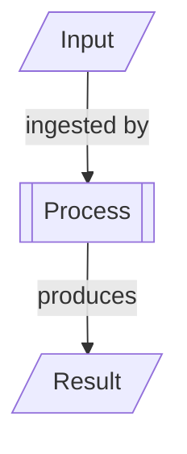

______________________________________________________________________

title: Documentation Writing Instructions
applyTo:

- docs/\*\*/\*.md
- README\*.md

______________________________________________________________________

## Documentation Writing Instructions

### Language and Style

- Use direct, concise sentences.
- Avoid bold text; do not use `**bold**` or `__bold__`.
- Do not use emojis.
- Avoid unnecessary repetitions.
- Use clear, unambiguous language.
- Use markdown references (`[Section](#section)`) to link between document sections.
- Always add markdown section identifiers (e.g., `## Section Name`).
- Use consistent backticks for code, keywords, and field names (e.g., `skos:notation`, `@context`).
- Use correct casing for acronyms and specification names (e.g., "JSON-LD", "CSV", "SKOS", "RDF").
- Do not alter the casing of standard acronyms or specification names.
- Numbered lists should always use `1.` for each item.
- Lines should not exceed 60 characters when generating new content, but do not re-wrap existing lines.

### Formatting

- Use only standard markdown features.
- Do not use HTML for formatting unless strictly necessary.
- Use fenced code blocks for examples and code.
- When showing mappings or field names, always wrap them in backticks.
- For YAML, Turtle, or JSON examples, use the appropriate code block language identifier.

### Diagrams

- All diagrams must use Mermaid format
  (fenced code block with `mermaid` language identifier).
- Do not use ASCII art diagrams.
- Use semantic, descriptive node IDs (not single letters).
- Node links must explicitly describe the action
  and nodes must explicitly describe the artifact in concise terms.
- Use parallelogram nodes (`[/" "/]`) for
  input and output files.
- Use rectangle nodes (`[" "]`) for
  actions and commands.
- Prefix command nodes with the command name
  followed by a colon and a short description
  (e.g., `"csv create: serializza la proiezione JSON-LD in CSV"`).

Example mermaid diagrams:

### Content Structure

- Start with a clear title and a short introduction.
- Use sections and subsections with clear headings.
- Each section should have a unique markdown identifier.
- Reference related documents using markdown links.
- When describing processes, use step-by-step numbered lists.
- For requirements, use bullet points or numbered lists as appropriate.
