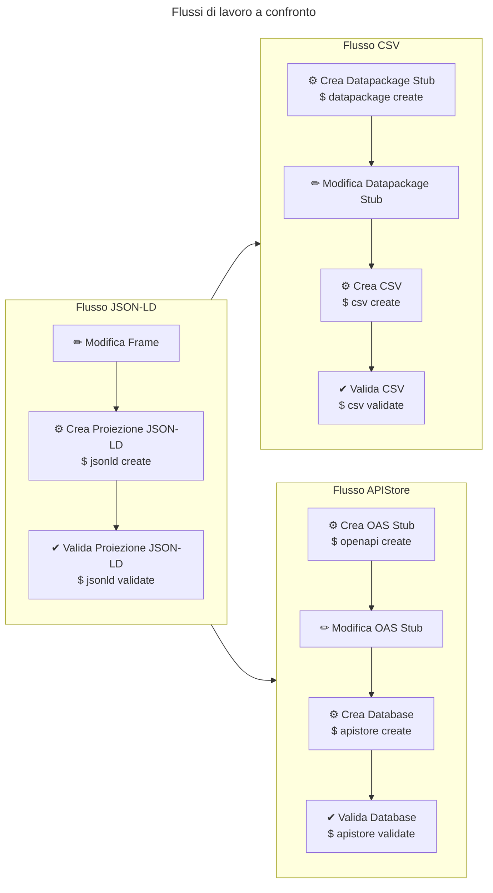
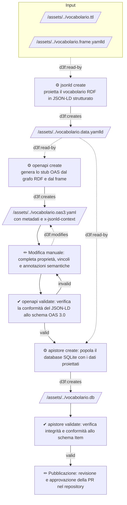

# Manuale: Generazione di un APIStore da vocabolari RDF

Questo documento descrive il flusso operativo
per generare e pubblicare un database SQLite
(APIStore) a partire da vocabolari controllati
in formato RDF/SKOS, usando gli strumenti della PoC.

Riferimenti: [README.api.md](README.api.md),
[README.csv.md](README.csv.md) e
[Glossario](glossario.md).

## Indice

- [Obiettivi](#obiettivi)
- [Flusso di lavoro](#flusso-di-lavoro)
- [Creare la proiezione JSON-LD](#creare-la-proiezione-json-ld)
- [Generare lo stub dell'OAS](#generare-lo-stub-delloas)
- [Modificare il file OAS](#modificare-il-file-oas)
- [Validare l'OAS](#validare-oas)
- [Creare il database APIStore](#creare-il-database-apistore)
- [Validare il database APIStore](#validare-il-database-apistore)
- [Aggregare più database](#aggregare-piu-database)
- [Pubblicare il database](#pubblicare-il-database)

## Obiettivi {#obiettivi}

Il processo descritto in questo documento
permette di:

1. Proiettare un vocabolario RDF/SKOS in una
   rappresentazione JSON-LD strutturata.
1. Descrivere la proiezione tramite un file
   OpenAPI Specification (OAS) conforme al
   [Modello di Interoperabilità](https://docs.italia.it/italia/piano-triennale-ict/lg-modellointeroperabilita-docs/).
1. Popolare un database SQLite (APIStore) con
   i dati del vocabolario proiettato.
1. Validare la correttezza del database
   prodotto rispetto allo schema OAS.
1. Aggregare più database in un unico
   APIStore da pubblicare.

## Note editoriali

I diagrammi usano i seguenti simboli per indicare:

- ✏ (U+270F) - interazioni e modifiche manuali (modifica, pubblicazione)
- ⚙ (U+2699) — comandi CLI per creazione/generazione
- ✔ (U+2714) — comandi di validazione

Il simbolo `$` indica un comando da eseguire in terminale.

## Panoramica e similitudini con il flusso CSV {#panoramica}

Il flusso di lavoro per generare i dati per le API
è simile a quello per generare i CSV, come indica
questo diagramma:



## Flusso di lavoro {#flusso-di-lavoro}

Il flusso è articolato in questi passi:

1. Generare la proiezione JSON-LD tramite CLI.
1. Generare lo stub dell'OAS tramite CLI.
1. Modificare manualmente l'OAS.
1. Validare l'OAS con il comando
   `openapi validate`.
1. Creare il database con il comando
   `apistore create`.
1. Validare il database con il comando
   `apistore validate`.
1. Pubblicare il database tramite PR nel
   repository.



## Creare la proiezione JSON-LD {#creare-la-proiezione-json-ld}

La proiezione JSON-LD si genera dal vocabolario
RDF e dal frame JSON-LD, esattamente come
nel flusso CSV.
Se la proiezione prodotta per la
distribuzione CSV contiene tutti i campi necessari,
può essere riusata senza rigenerarla:
si potranno poi selezionare i soli campi da includere
nel CSV configurando opportunamente il `datapackage.yaml`.

:warning: Il passaggio di proiezione è sempre necessario,
perché `jsonld create` supporta una serie di opzioni
utili a gestire la variabilità di modellazione dei vocabolari RDF.

```bash
schema_gov_it_tools.bin jsonld create \
  --ttl provinces.ttl \
  --frame provinces.frame.yamlld \
  --vocabulary-uri https://w3id.org/italia/controlled-vocabulary/territorial-classifications/provinces \
  --output provinces.data.yamlld
```

Per escludere dalla proiezione i campi non
mappati nel `@context` del frame, aggiungere
`--frame-only`.

La proiezione prodotta (`provinces.data.yamlld`)
sarà uno degli input per `apistore create`.

## Generare lo stub dell'OAS {#generare-lo-stub-delloas}

La CLI genera uno stub dell'OAS a partire dal
vocabolario RDF, dal frame e dall'URI del
vocabolario.
Lo stub contiene i metadati estratti dal grafo
RDF e il `x-jsonld-context` derivato dal frame.

```bash
schema_gov_it_tools.bin openapi create \
  --ttl provinces.ttl \
  --jsonld provinces.data.yamlld \
  --frame provinces.frame.yamlld \
  --vocabulary-uri https://w3id.org/italia/controlled-vocabulary/territorial-classifications/provinces \
  --output provinces.oas3.yaml
```

L'opzione `--max-samples N` limita il numero
di record usati per l'inferenza dello schema.
Con `--max-samples 0` (default) vengono usati
tutti i record.

Di default, se il file di destinazione esiste,
la CLI non lo sovrascrive.
Per sovrascrivere usare il flag `--force`.

Esempio di stub generato a partire dal
vocabolario <https://w3id.org/italia/controlled-vocabulary/territorial-classifications/provinces>:

```yaml
components:
  schemas:
    Item:
      example:
        acronym: TO
        id: '001'
        label_it: Torino
        nuts:
        - url: http://nuts.geovocab.org/id/ITC11
        parent:
        - url: ../regions/01
        url: '001'
        vocab:
        - url: ../provinces
      properties:
        acronym:
          type: string
        id:
          minLength: 1
          pattern: ^[A-Za-z0-9._-]+$
          type: string
        label_it:
          maxLength: 500
          minLength: 1
          type: string
        nuts:
          items:
            properties:
              url:
                format: uri-reference
                type: string
            required:
            - url
            type: object
          maxItems: 100
          minItems: 0
          type: array
        parent:
          items:
            properties:
              url:
                format: uri-reference
                type: string
            required:
            - url
            type: object
          maxItems: 100
          minItems: 0
          type: array
        url:
          format: uri-reference
          type: string
        vocab:
          items:
            properties:
              url:
                format: uri-reference
                type: string
            required:
            - url
            type: object
          maxItems: 100
          minItems: 0
          type: array
      required:
      - acronym
      - id
      - label_it
      - nuts
      - parent
      - url
      - vocab
      type: object
      x-jsonld-context:
        '@base': https://w3id.org/italia/controlled-vocabulary/territorial-classifications/provinces/
        '@vocab': https://w3id.org/italia/onto/CLV/
        acronym:
          '@id': clvapit:acronym
        clvapit: https://w3id.org/italia/onto/CLV/
        dct: http://purl.org/dc/terms/
        id:
          '@id': skos:notation
        l0: https://w3id.org/italia/onto/l0/
        label_it:
          '@id': skos:prefLabel
          '@language': it
        nuts:
          '@container': '@set'
          '@context':
            url: '@id'
          '@id': owl:sameAs
        owl: http://www.w3.org/2002/07/owl#
        parent:
          '@container': '@set'
          '@context':
            url: '@id'
          '@id': skos:broader
        rdfs: http://www.w3.org/2000/01/rdf-schema#
        skos: http://www.w3.org/2004/02/skos/core#
        url: '@id'
        vocab:
          '@container': '@set'
          '@context':
            url: '@id'
          '@id': skos:inScheme
        xsd: http://www.w3.org/2001/XMLSchema#
      x-jsonld-type: clvapit:Province
      x-validation:
        error_count: 0
        errors: []
        valid: true
info:
  contact:
    email: info@dati.gov.it
    name: banche dati e open data
    url: https://w3id.org/italia/data/public-organization/agid
  description: Vocabolario controllato delle province d'Italia
    e relativo codice regione
  title: Vocabolario Controllato delle Province d'Italia
  version: 2.0 - allineamento all'ontologia e alle pratiche di
    gestione dei vocabolari controllati di OntoPiA
  x-agencyId: agid
  x-keyConcept: provinces
  x-summary: ''
openapi: 3.0.3
paths: {}
servers: []
```

I metadati principali sono estratti dalle
seguenti proprietà RDF:

| Campo OAS           | Proprietà RDF                         |
| ------------------- | ------------------------------------- |
| `info.title`        | `dct:title` o `skos:prefLabel`        |
| `info.description`  | `dct:description` o `skos:definition` |
| `info.version`      | `owl:versionInfo`                     |
| `info.x-agencyId`   | identificatore dell'ente erogatore    |
| `info.x-keyConcept` | `ndc:keyConcept`                      |

## Modificare il file OAS {#modificare-il-file-oas}

Lo stub generato automaticamente è un punto
di partenza: l'Erogatore deve revisionarlo
e completarlo prima di procedere alla
creazione del database.

Operazioni tipiche di modifica manuale:

1. Verificare i metadati estratti
   (`title`, `description`, ecc.) e
   correggerli se necessario.
1. Completare i tipi e i vincoli JSON Schema
   in `components/schemas/Item/properties`
   (ad esempio `minLength`, `pattern`,
   `format: uri-reference`).
1. Definire i campi obbligatori in
   `components/schemas/Item/required`.
1. Verificare che `x-jsonld-context`
   rispecchi il `@context` del frame.
1. Verificare che `x-jsonld-type` corrisponda
   al tipo RDF del concetto (ad esempio
   `skos:Concept` o un tipo dell'ontologia).

:warning: Se si usa lo stesso JSON-LD frame per
generare sia CSV che OAS, è importante che il `@context`
sia compatibile con entrambi i flussi,
e che il datapackage non contenga campi non scalari
(e.g., array o oggetti) che non possono essere rappresentati
in CSV.

## Validare l'OAS {#validare-oas}

Prima di creare il database, è possibile
verificare che l'OAS sia conforme allo
schema OAS 3.0:

```bash
schema_gov_it_tools.bin openapi validate \
  --openapi provinces.oas3.yaml
```

Il comando verifica che il file sia YAML/JSON
valido e conforme allo schema OAS 3.0.

## Creare il database APIStore {#creare-il-database-apistore}

Con l'OAS completato, creare il database:

```bash
schema_gov_it_tools.bin apistore create \
  --ttl provinces.ttl \
  --jsonld provinces.data.yamlld \
  --oas provinces.oas3.yaml \
  --output provinces.db
```

I parametri `--ttl` e `--jsonld` sono entrambi necessari,
dal TTL si estraggono i metadati del
vocabolario (titolo, descrizione, versione,
`agencyId`, `keyConcept`) inseriti nel database.

Di default, se il file di destinazione esiste,
la CLI non lo sovrascrive.
Per sovrascrivere usare il flag `--force`.

## Validare il database APIStore {#validare-il-database-apistore}

Il comando `apistore validate` verifica
l'integrità strutturale del database e la
conformità di ogni voce allo schema
`components/schemas/Item` dell'OAS:

```bash
schema_gov_it_tools.bin apistore validate \
  --db provinces.db \
  --oas provinces.oas3.yaml
```

Il processo di validazione:

1. Verifica l'integrità SQLite del database.
1. Controlla la struttura e il contenuto
   delle tabelle.
1. Per ogni vocabolario registrato nel
   database, recupera tutte le voci e le
   valida rispetto allo schema JSON Schema
   definito in `components/schemas/Item`
   dell'OAS.

In caso di errori di validazione, il comando
riporta i primi 10 errori con la posizione
della voce e il messaggio di errore.
Ad esempio, se il vincolo `minLength: 10`
fosse applicato al campo `acronym`
(che in `provinces` vale "TO", "VC", ecc.),
l'output sarebbe:

```bash
✗ APIStore validation failed: 10 entry validation error(s):
agid/provinces[0] ['acronym']: 'TO' is too short
agid/provinces[1] ['acronym']: 'VC' is too short
agid/provinces[2] ['acronym']: 'NO' is too short
agid/provinces[3] ['acronym']: 'CN' is too short
agid/provinces[4] ['acronym']: 'AT' is too short
...
```

Il formato di ogni riga è:
`{agencyId}/{keyConcept}[{indice}] {campo}: {messaggio}`.

Il livello di log si configura con le opzioni
`-l` o `--log-level` a livello top-level,
prima del sottocomando. I valori supportati
sono: `critical`, `error`, `warning`,
`info`, `debug`.

```bash
schema_gov_it_tools.bin --log-level debug apistore validate \
  --db provinces.db \
  --oas provinces.oas3.yaml
```

I comandi restituiscono exit code `0`
in caso di successo e un codice non-zero
in caso di errore.

## Aggregare più database {#aggregare-piu-database}

Il comando `apistore collect` fonde più
database APIStore in un unico database
aggregato:

```bash
schema_gov_it_tools.bin apistore collect \
  --output all-vocabularies.db \
  assets/controlled-vocabularies/provinces/provinces.db \
  assets/controlled-vocabularies/ateco-2025/ateco-2025.db
```

È possibile passare:

- percorsi di file `.db` singoli;
- percorsi di directory (il comando
  raccoglie ricorsivamente tutti i `.db`
  che hanno un `.ttl` corrispondente);
- URL HTTPS di file `.db` remoti.

Esempio con URL remoti:

```bash
schema_gov_it_tools.bin apistore collect \
  --output all-vocabularies.db \
  https://raw.githubusercontent.com/teamdigitale/dati-semantic-csv-apis/main/assets/controlled-vocabularies/provinces/provinces.db \
  https://raw.githubusercontent.com/teamdigitale/dati-semantic-csv-apis/main/assets/controlled-vocabularies/ateco-2025/ateco-2025.db
```

Per ignorare le risorse remote non trovate
(HTTP 404) invece di interrompere
l'esecuzione:

```bash
schema_gov_it_tools.bin apistore collect \
  --output all-vocabularies.db \
  --skip-not-found \
  https://example.com/provinces.db \
  https://example.com/missing.db
```

## Pubblicare il database {#pubblicare-il-database}

Il repository include un workflow CI che
automatizza la generazione e la validazione
del database APIStore. Il workflow:

1. Si attiva con una `push` sul branch
   `main` (se sono cambiati file in
   `assets/controlled-vocabularies/**`)
   o manualmente.
1. Per ogni cartella in
   `assets/controlled-vocabularies/*`
   che contiene un `.oas3.yaml` e un
   `.frame.yamlld`:
   - installa la CLI;
   - genera il database con
     `apistore create`;
   - crea o aggiorna una PR verso il
     branch di destinazione.

L'Erogatore deve:

1. Assicurarsi che il file `.oas3.yaml`
   e il file `.data.yamlld` siano presenti
   nella cartella del vocabolario.
1. Revisionare il database generato.
1. Approvare la PR generata dal workflow
   per pubblicare il database.

### Relazione tra OAS e frame JSON-LD {#oas-e-frame}

L'OAS ha un doppio ruolo nel flusso
APIStore:

- il campo `x-jsonld-context` in
  `components/schemas/Item` funge da frame
  JSON-LD per il comando `apistore create`
  quando non viene fornito `--jsonld`;
- lo schema JSON Schema in
  `components/schemas/Item/properties` e
  `required` viene usato da
  `apistore validate` per validare ogni
  voce del database.

È quindi importante che `x-jsonld-context`
sia coerente con il frame usato per
generare la proiezione JSON-LD, e che
lo schema JSON Schema rifletta la struttura
effettiva delle voci proiettate.

### Differenza rispetto al flusso CSV {#differenza-csv}

Il flusso APIStore e il flusso CSV condividono
il vocabolario RDF sorgente e il frame
JSON-LD, ma producono distribuzioni
indipendenti:

| Aspetto        | CSV                         | APIStore                    |
| -------------- | --------------------------- | --------------------------- |
| Output         | File CSV + datapackage.yaml | Database SQLite (.db) + OAS |
| Metadati       | Frictionless Data Package   | OpenAPI Specification       |
| Struttura dati | Righe piatte                | Documenti JSON con schema   |
| Validazione    | Roundtrip CSV → RDF         | JSON Schema da OAS          |
| Aggregazione   | N/A                         | `apistore collect`          |

La proiezione JSON-LD (`.data.yamlld`)
è compatibile con entrambi i flussi:
lo stesso file può essere passato sia a
`csv create` che ad `apistore create`.
