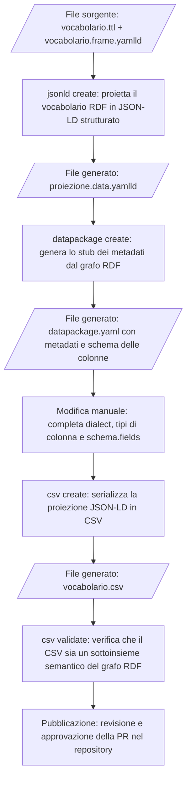

# Manuale: Generazione di CSV da vocabolari RDF

Questo documento descrive il flusso operativo
per generare e pubblicare CSV a partire da
vocabolari controllati in formato RDF/SKOS,
usando gli strumenti della PoC.

Riferimenti: [README.csv.md](README.csv.md) e
[Glossario](glossario.md).

## Indice

- [Obiettivi](#obiettivi)
- [Flusso di lavoro](#flusso-di-lavoro)
- [Creare la proiezione con la UI](#creare-la-proiezione-con-la-ui)
- [Requisiti del file di frame](#requisiti-del-frame)
- [Mappare i valori della proiezione](#mappare-i-valori-della-proiezione)
- [Generare lo stub del datapackage](#generare-lo-stub-del-datapackage)
- [Modificare il datapackage.yaml](#modificare-il-datapackageyaml)
- [Generare il CSV](#generare-il-csv)
- [Validare il CSV](#validare-il-csv)
- [Pubblicare il CSV](#pubblicare-il-csv)
- [Scelte di progettazione](#scelte-di-progettazione)

## Obiettivi {#obiettivi}

Il processo descritto in questo documento
permette di:

1. Proiettare un vocabolario RDF/SKOS in una
   rappresentazione JSON-LD strutturata.
1. Generare un file CSV annotato semanticamente
   a partire dalla proiezione JSON-LD.
1. Metadatare il CSV tramite un file
   `datapackage.yaml` conforme a
   [Frictionless Data Package](https://datapackage.org/profiles/2.0/datapackage.json).
1. Validare la correttezza semantica del CSV
   prodotto rispetto al grafo RDF originale.

## Flusso di lavoro {#flusso-di-lavoro}

Il flusso è articolato in questi passi:

1. Creare il frame JSON-LD usando la UI
   dello Schema Editor.
1. Generare la proiezione JSON-LD dei dati
   tramite CLI.
1. Generare lo stub del `datapackage.yaml`
   tramite CLI.
1. Modificare manualmente il
   `datapackage.yaml`.
1. Generare il CSV con il comando
   `csv create`.
1. Validare il CSV con il comando
   `csv validate`.
1. Pubblicare il CSV tramite PR nel repository.



## Creare la proiezione con la UI {#creare-la-proiezione-con-la-ui}

Lo Schema Editor fornisce un supporto visuale
alla definizione del frame JSON-LD.
Tramite l'RDF Helper, è possibile accedere
all'interfaccia di framing, basata sul
JSON-LD Playground del W3C.

1. Aprire il vocabolario nello Schema Editor.
1. Accedere alla UI di framing tramite
   l'RDF Helper.
1. Modificare il frame nella UI fino a
   ottenere la proiezione JSON-LD desiderata.
   La UI inserisce automaticamente un
   `@context` e un frame di default
   che dovrà essere adattato alle necessità
   di proiezione.
1. Salvare il frame nella cartella del
   vocabolario come
   `${vocabulary_name}.frame.yamlld`.

Il frame deve includere - tramite appositi commenti - documentazione,
sulle scelte di proiezione e sui campi generati.

Una volta definito il frame, generare la
proiezione JSON-LD.
La generazione avviene attraverso il seguente comando del pacchetto schema_gov_it_tools.bin

`jsonld create`:

```bash
schema_gov_it_tools.bin jsonld create \
  --ttl agente_causale.ttl \
  --frame agente_causale.frame.yamlld \
  --vocabulary-uri https://w3id.org/italia/work-accident/controlled-vocabulary/adm_serv/agente_causale \
  --output agente_causale.data.yamlld
```

Per escludere i campi non mappati nel
`@context` (vedi
[Filtro dei campi non mappati](#filtro-dei-campi-non-mappati)):

```bash
schema_gov_it_tools.bin jsonld create \
  --ttl agente_causale.ttl \
  --frame agente_causale.frame.yamlld \
  --vocabulary-uri https://w3id.org/italia/work-accident/controlled-vocabulary/adm_serv/agente_causale \
  --output agente_causale.data.yamlld \
  --frame-only
```

## Requisiti del file di frame {#requisiti-del-frame}

Il file di frame (`*.frame.yamlld`) è validato
automaticamente da tutti i comandi CLI che
accettano il parametro `--frame`.
La struttura richiesta è definita nello schema
`tools/data/frame.schema.yaml`.

### Struttura obbligatoria del `@context`

Il `@context` deve essere un dizionario:
i contesti remoti (stringa URI) non sono supportati.

Il `@context` deve contenere obbligatoriamente
i seguenti campi:

| Campo   | Valore richiesto | Descrizione                               |
| ------- | ---------------- | ----------------------------------------- |
| `uri`   | `"@id"`          | URI del concetto (identificatore JSON-LD) |
| `label` | qualsiasi        | Etichetta principale del concetto         |

Il campo `uri` identifica univocamente ogni
concetto nella proiezione e diventa una colonna
nel CSV risultante.

Esempio minimale valido:

```yaml
"@context":
  uri: "@id"
  label:
    "@id": skos:prefLabel
    "@language": it
"@type": skos:Concept
uri: {}
label: {}
```

Frame non valido — campo `uri` mancante:

```yaml
"@context":
  label:
    "@id": skos:prefLabel
    "@language": it
```

```
✗ Invalid frame: 'uri' is a required property
```

### `@type` obbligatorio e singolo

Il frame deve specificare esattamente un tipo RDF
con il campo `@type`. Una lista con più valori
non è ammessa.

```yaml
# Valido: valore singolo
"@type": skos:Concept

# Valido: lista con un solo elemento
"@type":
  - skos:Concept

# Non valido: lista con più valori
"@type":
  - skos:Concept
  - owl:Thing
```

```
✗ Invalid frame: Frame must specify a single @type, found list: ['skos:Concept', 'owl:Thing']
```

### Campi gerarchici: `parent` e `vocab`

I campi `parent` e `vocab`, se presenti nel
`@context`, devono rispettare questi vincoli:

- `@container` obbligatorio: valore `"@set"` o
  `"@list"`.
- `@type` non può essere `"@vocab"` o `"@id"`.
- Il `@context` annidato, se presente, deve
  mappare `uri: "@id"`.

Esempio valido:

```yaml
parent:
  "@id": skos:broader
  "@container": "@set"
  "@context":
    uri: "@id"
```

Frame non valido — `@container` mancante su `parent`:

```yaml
parent:
  "@id": skos:broader
```

```
✗ Invalid frame: '@container' is a required property
```

### Valori ammessi in modalità strict

Quando la CLI elabora il frame in modalità
strict (attivata automaticamente durante la
generazione e la validazione di CSV e API), i
campi con nome riservato devono mappare solo le
proprietà RDF elencate. La violazione produce
un errore con i valori ammessi.

| Campo    | Proprietà RDF ammesse                              |
| -------- | -------------------------------------------------- |
| `id`     | `skos:notation`, `dct:identifier`, `dc:identifier` |
| `label`  | `skos:prefLabel`, `rdfs:label`                     |
| `level`  | `clvapit:hasRankOrder`, `xkos:depth`               |
| `parent` | `skos:broader`                                     |
| `vocab`  | `skos:inScheme`                                    |

I campi aggiuntivi per label localizzate
(`label_it`, `label_en`, `label_de` ecc.) non
sono soggetti a questa restrizione.

Frame non valido — `label` mappato su `altLabel`:

```yaml
label:
  "@id": skos:altLabel
  "@language": it
```

```
✗ Invalid frame: Frame field 'label' must be one of ['http://www.w3.org/2004/02/skos/core#prefLabel', 'http://www.w3.org/2000/01/rdf-schema#label'], got http://www.w3.org/2004/02/skos/core#altLabel.
```

## Mappare i valori della proiezione {#mappare-i-valori-della-proiezione}

Ogni campo inserito nella proiezione deve essere
mappato nel `@context` del frame: ogni nome di campo
deve essere associato alla corrispondente proprietà
RDF.

La mappatura definisce come i valori della proiezione
vengono interpretati semanticamente. Senza una
mappatura esplicita, un campo non è riconducibile
a nessuna proprietà RDF e la proiezione non è
verificabile rispetto al vocabolario originale.

I nomi scelti nel `@context` diventano i nomi
delle colonne del CSV risultante: è quindi
importante sceglierli con cura e mantenerli stabili
nel tempo (vedi
[Nomi dei campi nella proiezione](#nomi-dei-campi-nella-proiezione)).

Inoltre, sono ammessi solo alcuni valori per degli specifici campi.
In caso di errore, il tool suggerisce i valori ammessi.
Esempio che rompe la validazione del frame:

```yaml
  label:
    "@id": skos:altLabel
    "@language": it
```

si riceverà un errore simile a :

```
ValueError: Frame field 'label' must be one of ['http://www.w3.org/2004/02/skos/core#prefLabel', 'http://www.w3.org/2000/01/rdf-schema#label'], got http://www.w3.org/2004/02/skos/core#altLabel.
Supported fields and their allowed IRIs:
  - 'id': ['http://www.w3.org/2004/02/skos/core#notation', 'http://purl.org/dc/terms/identifier', 'http://purl.org/dc/elements/1.1/identifier']
  - 'label': ['http://www.w3.org/2004/02/skos/core#prefLabel', 'http://www.w3.org/2000/01/rdf-schema#label']
  - 'level': ['https://w3id.org/italia/onto/CLV/hasRankOrder', 'http://rdf-vocabulary.ddialliance.org/xkos#depth']
  - 'parent': ['http://www.w3.org/2004/02/skos/core#broader']
  - 'vocab': ['http://www.w3.org/2004/02/skos/core#inScheme']
```

## Generare lo stub del datapackage {#generare-lo-stub-del-datapackage}

La CLI genera uno stub del `datapackage.yaml`
a partire dal file RDF e dal file di framing.
Lo stub contiene i metadati estratti
automaticamente dal grafo RDF.

```bash
schema_gov_it_tools.bin datapackage create \
  --ttl agente_causale.ttl \
  --frame agente_causale.frame.yamlld \
  --vocabulary-uri https://w3id.org/italia/work-accident/controlled-vocabulary/adm_serv/agente_causale \
  --output datapackage.yaml
```

Esempio di stub generato a partire dal
vocabolario `agente_causale`:

```yaml
$schema: >-
  https://datapackage.org/profiles/2.0/datapackage.json
id: >-
  https://w3id.org/italia/work-accident/controlled-vocabulary/adm_serv/agente_causale
name: agente_causale
title: >-
  Vocabolario Controllato sulla classificazione
  degli agenti causali adottata dall'INAIL
version: '0.5'
created: '2022-09-06T00:00:00Z'
description: >-
  Decodifica dell'agente, lavorazione, o esposizione
  che puo' essere causa o concausa di malattia
keywords:
- agente causale
- chemical product
- inail
- infortunio
- malattia professionale
- occupational accident
- occupational disease
- prodotto chimico
sources:
- path: >-
    https://w3id.org/italia/work-accident/controlled-vocabulary/adm_serv/agente_causale
resources:
- name: agente_causale
  type: table
  path: agente_causale.csv
  format: csv
  encoding: utf-8
  mediatype: text/csv
  schema:
    x-jsonld-context: ...
    fields:
    - name: uri
      type: string
    - name: id
      type: string
    - name: label
      type: string
    - name: level
      type: integer
```

I metadati principali sono estratti dalle
seguenti proprietà RDF:

| Campo datapackage | Proprietà RDF                         |
| ----------------- | ------------------------------------- |
| `name`            | `ndc:keyConcept`                      |
| `title`           | `dct:title` o `skos:prefLabel`        |
| `id`              | URI della risorsa                     |
| `description`     | `dct:description` o `skos:definition` |
| `version`         | `owl:versionInfo`                     |
| `created`         | `dct:issued`                          |

## Modificare il datapackage.yaml {#modificare-il-datapackageyaml}

Lo stub generato automaticamente è un punto
di partenza: l'Erogatore deve revisionarlo
e integrarlo prima di procedere alla
generazione del CSV.

Operazioni tipiche di modifica manuale:

1. Verificare i metadati estratti
   (`title`, `description`, `keywords`, ecc.)
   e correggerli se necessario.
1. Definire il `dialect` CSV, specificando
   delimitatore, encoding, quoting, ecc.
1. Completare il campo `schema.fields`
   con i tipi corretti per ogni colonna.
1. Aggiungere o rimuovere campi dalla lista
   `resources[0].schema.fields` per controllare
   quali colonne saranno presenti nel CSV.
1. Verificare che il campo
   `x-jsonld-context` rispecchi il `@context`
   del file di framing.

Esempio di `schema` completo per una risorsa:

```yaml
resources:
- name: agente_causale
  type: table
  path: agente_causale.csv
  format: csv
  encoding: utf-8
  mediatype: text/csv
  dialect:
    delimiter: ","
    lineTerminator: "\n"
    quoteChar: "\""
    doubleQuote: true
    skipInitialSpace: true
    header: true
    caseSensitiveHeader: false
  schema:
    x-jsonld-context:
      "@base": >-
        https://w3id.org/italia/work-accident/controlled-vocabulary/adm_serv/agente_causale/
      dct: http://purl.org/dc/terms/
      skos: http://www.w3.org/2004/02/skos/core#
      uri: "@id"
      id:
        "@id": skos:notation
      label:
        "@id": skos:prefLabel
        "@language": it
    fields:
    - name: uri
      type: string
    - name: id
      type: string
    - name: label
      type: string
    - name: level
      type: integer
```

I campi non inclusi in `schema.fields`
non saranno presenti nel CSV, anche se
sono nella proiezione JSON-LD. Questo
consente di escludere campi complessi
(oggetti o array) che non possono essere
rappresentati in modo coerente in CSV.

## Generare il CSV {#generare-il-csv}

Con il `datapackage.yaml` corretto, generare
il CSV:

```bash
schema_gov_it_tools.bin csv create \
  --jsonld agente_causale.data.yamlld \
  --datapackage datapackage.yaml
```

Il percorso di output viene letto dal campo
`resources[0].path` del `datapackage.yaml`.
Per specificarne uno diverso:

```bash
schema_gov_it_tools.bin csv create \
  --jsonld agente_causale.data.yamlld \
  --datapackage datapackage.yaml \
  --output output/agente_causale.csv
```

Di default, se il file di destinazione esiste, la CLI non lo sovrascrive.
Per sovrascrivere un file di destinazione esistente,
usare il flag `--force`.

Esempio di CSV prodotto a partire dal
vocabolario `agente_causale`:

```
"uri","id","label","level"
"https://.../agente_causale/grande_gruppo/1","1","Agenti chimici inorganici","1"
"https://.../agente_causale/gruppo/1.1","1.1","Agenti chimici inorganici gruppo a","2"
"https://.../agente_causale/agente/11110101","11110101","Idrogeno","3"
```

Il valore della colonna `uri` dipende dalla
configurazione di `@base` nel frame: senza
`@base` viene serializzato l'URI completo,
con `@base` il suffisso relativo (vedi
[Uso di @base](#uso-di-base)).

## Validare il CSV {#validare-il-csv}

Il comando `csv validate` verifica che il CSV
prodotto sia un sottoinsieme semanticamente
corretto del grafo RDF originale:

```bash
schema_gov_it_tools.bin csv validate \
  --datapackage datapackage.yaml \
  --ttl agente_causale.ttl \
  --vocabulary-uri https://w3id.org/italia/work-accident/controlled-vocabulary/adm_serv/agente_causale
```

Il processo di validazione:

1. Legge il CSV usando il `dialect`
   definito nel `datapackage.yaml`.
1. Converte il CSV in JSON-LD usando
   l'`x-jsonld-context` del datapackage.
1. Converte il JSON-LD in RDF.
1. Verifica che l'RDF risultante sia
   un sottoinsieme del vocabolario originale.

Per validare solo la struttura del datapackage
senza il CSV:

```bash
schema_gov_it_tools.bin datapackage validate \
  --datapackage datapackage.yaml
```

## Pubblicare il CSV {#pubblicare-il-csv}

Il repository include un workflow CI che
automatizza la generazione e la validazione
dei CSV. Il workflow:

1. Si attiva con una `push` su un branch
   dedicato (ad esempio `#asset`) o
   manualmente.
1. Per ogni cartella in
   `assets/controlled-vocabularies/*`:
   - installa la CLI;
   - genera il CSV dal `datapackage.yaml`;
   - valida il CSV rispetto al
     `datapackage.yaml`;
   - crea o aggiorna una PR verso il
     branch di destinazione.

L'Erogatore deve:

1. Revisionare il CSV generato e validato.
1. Verificare che il CSV rappresenti
   correttamente il vocabolario RDF originale.
1. Approvare la PR generata dal workflow
   per pubblicare il CSV.

## Scelte di progettazione {#scelte-di-progettazione}

### Uso di `@base` {#uso-di-base}

La presenza di `@base` nel `@context` del
frame determina se gli URI dei concetti
vengono serializzati come URI completi o
come identificatori relativi (con il prefisso
rimosso).

Con `@base` impostato:

```yaml
"@context":
  "@base": >-
    https://w3id.org/italia/work-accident/controlled-vocabulary/adm_serv/agente_causale/
  uri: "@id"
```

Gli URI vengono ridotti al suffisso relativo.
Ad esempio, il concetto
`agente/11110101` nel campo `uri` rappresenta:

```
https://w3id.org/italia/work-accident/controlled-vocabulary/adm_serv/agente_causale/agente/11110101
```

Senza `@base` (o con `"@base": null`):

```yaml
"@context":
  "@base": null
  uri: "@id"
```

Gli URI vengono serializzati per intero.

Scegliere `@base` in base alle esigenze
dei Fruitori: gli URI completi sono più
portabili, i valori relativi sono più
leggibili e compatti.

### Uso di `parent` e `vocab` {#uso-di-parent-e-vocab}

Il campo `parent` mappa `skos:broader` e
permette di rappresentare le gerarchie del
vocabolario. Deve essere configurato come
array (`@container: @set`) per supportare
concetti con più genitori.

Esempio dal frame di `agente_causale`:

```yaml
parent:
  "@id": skos:broader
  "@container": "@set"
  "@context":
    uri: "@id"
    id:
      "@id": skos:notation
```

Il campo `vocab` mappa `skos:inScheme` e
identifica il vocabolario di appartenenza.
Serve anche come criterio di filtro nel
frame per limitare la proiezione ai soli
concetti del vocabolario indicato:

```yaml
vocab:
  "@id": skos:inScheme
  "@container": "@set"
  "@context":
    uri: "@id"

# Nel corpo del frame:
vocab:
- uri: >-
    https://w3id.org/italia/work-accident/controlled-vocabulary/adm_serv/agente_causale
  "@explicit": true
  "@embed": "@never"
```

In questo modo la proiezione include solo
i concetti esplicitamente appartenenti al
vocabolario indicato in `vocab`.

### Nomi dei campi nella proiezione {#nomi-dei-campi-nella-proiezione}

I nomi dei campi definiti nel `@context`
diventano i nomi delle colonne del CSV.
La scelta dei nomi è a discrezione
dell'Erogatore, ma deve rispettare
i seguenti vincoli:

- I nomi devono essere validi come chiavi JSON
  e come intestazioni CSV.
- I nomi devono essere stabili: una modifica
  rompe la compatibilità con i Fruitori
  esistenti.
- Se si usa `@base`, i campi che contengono
  URI (come `uri`, `parent`, `vocab`) avranno
  valori relativi; documentarlo nel
  `datapackage.yaml`.

Per le label localizzate, una convenzione
comune è usare il suffisso della lingua per i
campi aggiuntivi: `label_en`, `label_de`, ecc.
Il campo `label` resta obbligatorio e deve
corrispondere alla lingua principale del vocabolario.

Esempio dal frame di `agente_causale`:

```yaml
"@context":
  # "@base" con URI del vocabolario rende i valori
  # di uri, parent e vocab relativi a questo prefisso.
  "@base": >-
    https://w3id.org/italia/work-accident/controlled-vocabulary/adm_serv/agente_causale/
  uri: "@id"
  id:
    "@id": skos:notation
  label:
    "@id": skos:prefLabel
    "@language": it
  parent:
    "@id": skos:broader
    "@container": "@set"
    "@context":
      uri: "@id"
  vocab:
    "@id": skos:inScheme
    "@container": "@set"
    "@context":
      uri: "@id"
  level:
    "@id": clvapit:hasRankOrder
    "@type": xsd:int
```

Per vocabolari con label in più lingue, aggiungere
un campo per ciascuna lingua aggiuntiva accanto
al campo `label` obbligatorio:

```yaml
  label:
    "@id": skos:prefLabel
    "@language": it
  label_en:
    "@id": skos:prefLabel
    "@language": en
  label_de:
    "@id": skos:prefLabel
    "@language": de
```

I campi con valori complessi come `parent`
e `vocab` (array di oggetti) vengono
serializzati in CSV come stringhe JSON.
Se non sono utili nel CSV, rimuoverli da
`schema.fields` nel `datapackage.yaml`
senza modificare il frame.

### Filtro dei campi non mappati {#filtro-dei-campi-non-mappati}

Il framing JSON-LD può includere nella
proiezione campi che fanno riferimento alla
stessa proprietà RDF di un campo mappato,
anche se non definiti esplicitamente nel
`@context`.

Ad esempio, se `skos:notation` è mappata
al campo `id` con un tipo specifico
(`euvoc:ISO_639_1`), la notazione con un
altro tipo (`euvoc:ISO_639_3`) potrebbe
comparire nella proiezione come
`skos:notation`.

Per escludere questi campi, usare
`--frame-only` nel comando `jsonld create`.

### Uso dello strumento di validazione {#uso-dello-strumento-di-validazione}

Il comando `csv validate` è lo strumento
principale per verificare la correttezza
semantica del CSV prodotto. Deve essere
eseguito prima di ogni pubblicazione.

Il comando `jsonld validate` verifica che
la proiezione JSON-LD sia un sottoinsieme
del grafo RDF originale; è utile per
diagnosticare problemi nel frame prima di
procedere alla generazione del CSV.

Il livello di log si configura con le opzioni
`-l` o `--log-level` a livello top-level,
prima del sottocomando. I valori supportati
sono: `critical`, `error`, `warning`,
`info`, `debug`.

```bash
schema_gov_it_tools.bin --log-level debug csv validate \
  --datapackage datapackage.yaml \
  --ttl agente_causale.ttl \
  --vocabulary-uri https://w3id.org/italia/work-accident/controlled-vocabulary/adm_serv/agente_causale
```

I comandi restituiscono exit code `0`
in caso di successo e un codice non-zero
in caso di errore.
