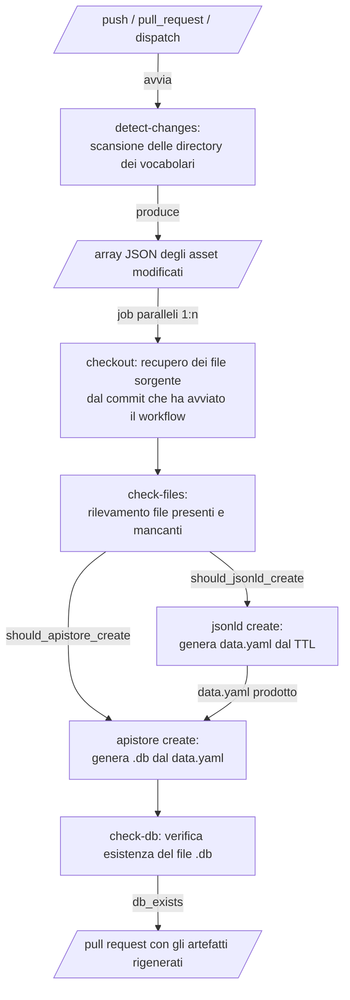

# Workflow CI APIStore Create

Questo documento descrive il workflow
`apistore-generation.yml`,
che rileva le modifiche agli asset di
vocabolario controllato e rigenera
i file JSON-LD e il database APIStore
corrispondenti.

## Indice

- [Trigger](#trigger)
- [Configurazione](#configurazione)
- [Struttura degli asset](#struttura-degli-asset)
- [Pipeline](#pipeline)
  - [Rilevamento delle modifiche](#rilevamento-delle-modifiche)
  - [Generazione degli artefatti](#generazione-degli-artefatti)
- [Creazione della pull request](#creazione-della-pull-request)
- [Prevenzione dei loop](#prevenzione-dei-loop)
- [PR concorrenti sullo stesso asset](#pr-concorrenti-sullo-stesso-asset)
- [Eccezioni](#eccezioni)

## Trigger

Il workflow si avvia in caso di:

- push verso il branch di base configurato quando
  cambiano i file sotto
  `assets/controlled-vocabularies/`
- pull request verso il branch di base
  configurato quando cambiano i file sotto
  `assets/controlled-vocabularies/`
- avvio manuale tramite `workflow_dispatch`
- chiamata da un altro workflow tramite
  `workflow_call`

Il branch base è configurato nel file
del workflow (es. `assets`).

Gli utenti devono adattare i trigger
alle proprie esigenze, inclusi il nome
del branch e il percorso degli asset.

## Configurazione

Il workflow espone i seguenti parametri:

| Parametro        | Tipo                  | Default                          | Descrizione                                                    |
| ---------------- | --------------------- | -------------------------------- | -------------------------------------------------------------- |
| `python_version` | input `workflow_call` | `3.14`                           | Versione di Python usata nel job `ci-api`                      |
| `CLI_VERSION`    | variabile d'ambiente  | `0.0.13`                         | Versione di `schema_gov_it_tools.bin` da scaricare             |
| `VOCABULARY_DIR` | variabile d'ambiente  | `assets/controlled-vocabularies` | Directory radice scansionata per le sottodirectory degli asset |
| `max_parallel`   | input `workflow_call` | `6`                              | Numero massimo di job asset eseguiti in parallelo              |

`python_version` è impostabile solo
tramite `workflow_call`.
`CLI_VERSION` e `VOCABULARY_DIR` sono
definiti nel file del workflow e devono
essere modificati direttamente lì.

## Struttura degli asset

Gli asset sono organizzati sotto
`assets/controlled-vocabularies/`.

La denominazione dei file segue il
principio convention-over-configuration:
tutti i file in una directory asset
condividono il nome base del file `.ttl`.
Questo evita configurazioni ridondanti
e ambiguità nei nomi tra tipi di asset.

Il workflow non modifica mai i file
di metadatazione (`.ttl`, `.frame.yamlld`, `dataframe.yaml`,
`.oas3.yaml`) e si aspetta che siano presenti e corretti.

| File                  | Ruolo                        |
| --------------------- | ---------------------------- |
| `<nome>.ttl`          | Ontologia RDF Turtle         |
| `<nome>.frame.yamlld` | Frame JSON-LD                |
| `<nome>.oas3.yaml`    | Specifica OpenAPI 3          |
| `<nome>.data.yaml`    | Dati JSON-LD (generato)      |
| `<nome>.db`           | Database APIStore (generato) |

Ogni directory deve contenere esattamente
un solo file `.ttl`. Le directory con più di
uno vengono saltate con un avviso.

## Pipeline

### Rilevamento delle modifiche

Il job `detect-changes` scansiona tutte
le directory degli asset e determina
cosa rigenerare in base ai file cambiati
rispetto al commit base.

| File modificato             | `needs_jsonld` | `needs_apistore` |
| --------------------------- | -------------- | ---------------- |
| `.ttl` o `.frame.yamlld`    | true           | true             |
| `.oas3.yaml` o `.data.yaml` | false          | true             |
| nessuno dei precedenti      | —              | saltato          |

Con `workflow_dispatch` o push su un
branch nuovo, tutti gli asset sono
trattati come completamente modificati.

### Generazione degli artefatti

Il job `ci-api` viene eseguito in
parallelo per ciascun asset modificato
(fino a `input.max_parallel` alla volta).
Per ogni asset:

1. Effettua il checkout del branch base
   e sovrappone i file sorgente del
   commit che ha avviato il workflow.

1. Scarica `schema_gov_it_tools.bin`
   alla versione CLI configurata.

1. Rileva i file presenti e calcola
   le azioni da compiere:

   - se manca il frame, fallisce
     poiché questo è necessario;
   - se il file sorgente o il frame sono
     cambiati, o se `data.yaml` è assente,
     imposta `should_jsonld_create` a true;
   - se il frame o la specifica OAS sono cambiati,
     imposta `should_apistore_create` a true.

1. Esegue `jsonld create` quando
   `should_jsonld_create` è true,
   producendo `<nome>.data.yaml`.

1. Esegue `apistore create` quando
   `should_apistore_create` è true,
   producendo `<nome>.db`.

1. Apre una pull request se
   `<nome>.db` è stato prodotto.

## Creazione della pull request

La pull request include il `data.yaml`
rigenerato (se prodotto) e `<nome>.db`.

Il branch di destinazione dipende
dal tipo di evento:

- evento pull request: il branch
  sorgente della pull request che
  ha avviato il workflow
- tutti gli altri eventi: il branch
  che ha avviato il workflow

Questo comportamento garantisce la
coerenza al momento del merge: quando
la PR degli artefatti viene unita al
branch sorgente, quel branch contiene
sia le modifiche sorgente sia gli
artefatti generati. Il successivo
merge nel branch base include tutto
in modo atomico, evitando uno stato
in cui i file sorgente arrivano nel
branch base senza i corrispondenti
`.data.yaml` e `.db`.

Il branch della pull request è nominato
`feat/apistore-generation<percorso_asset>`
e viene eliminato dopo il merge.
Porta le label `automated` e
`apistore-generation`.

## Prevenzione dei loop

I commit creati da questo workflow
includono `[skip ci]` nel messaggio
di commit. GitHub Actions sopprime
nativamente le esecuzioni del workflow
per tali commit, impedendo che il
workflow si inneschi su se stesso.

## PR concorrenti sullo stesso asset

Il branch della PR degli artefatti è
denominato in base al percorso dell'asset:
`feat/apistore-generation<percorso_asset>`.
Questo nome è lo stesso indipendentemente
da quale PR sorgente ha avviato il workflow.

Quando due PR aperte modificano lo stesso
asset, ciascuna avvia un'esecuzione separata
del workflow che scrive sullo stesso branch
degli artefatti. L'esecuzione successiva
sovrascrive quella precedente, incluso il
`base` della PR, che punterà al branch
sorgente della seconda PR.
La prima PR perderà quindi la propria PR
degli artefatti o si ritroverà con
artefatti che puntano a un branch diverso.

Per evitare questo, non avere due PR aperte
che modificano la stessa directory asset
contemporaneamente. Se inevitabile,
ri-avviare il workflow sulla prima PR
dopo che la seconda è stata unita.

## Eccezioni

Il workflow fornisce un esempio di come
escludere determinate directory: le
directory il cui percorso contiene
`theme-subtheme-mapping` sono escluse
da `jsonld create` e `apistore create`.
